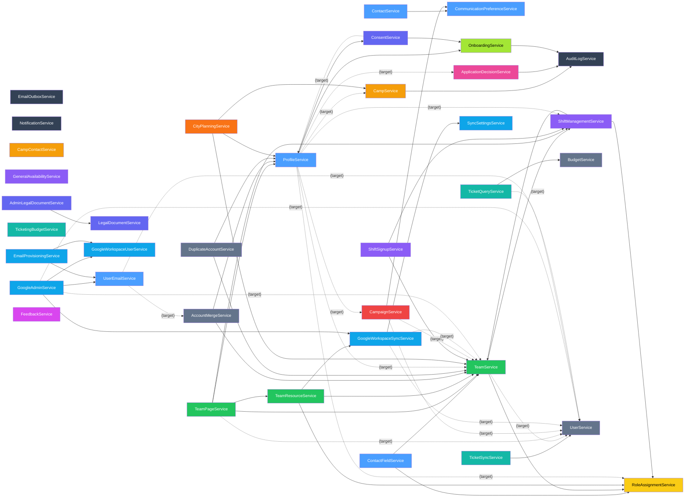

# Service Dependency Graph

Directed graph of service-to-service dependencies. Edges marked `(target)` don't exist yet — they represent direct DB queries that need to become service calls per DESIGN_RULES.md.

## How to read

- Arrow means "depends on" / "calls"
- `(target)` = dependency that needs to be added when migrating off direct DB access
- Cross-cutting services (AuditLog, Email, Notification, RoleAssignment) are shown separately to reduce noise

## Mermaid diagram

## Potential circular dependencies to watch

Based on the target state:

1. **ProfileService <-> OnboardingService**: ProfileService calls OnboardingService, and OnboardingService will need profile data. Currently resolved because OnboardingService queries profiles via DB. When migrated, may need interface extraction or an orchestration pattern.

2. **ProfileService <-> ConsentService**: ProfileService calls ConsentService, ConsentService needs profile data `(target)`. Same pattern — may need interface extraction.

3. **TeamService <-> ShiftManagementService**: TeamService calls ShiftManagementService, and ShiftManagementService now calls TeamService. Circular dependency resolved via `IServiceProvider` lazy resolution in ShiftManagementService (same pattern as ConsentService and MembershipCalculator).

## Fan-in hotspots (most depended-on services)

| Service | Current dependents | Target additional |
|---------|-------------------|-------------------|
| `AuditLogService` | 12 | 0 |
| `NotificationService` | 7 | 0 |
| `EmailService` | 7 | 0 |
| `RoleAssignmentService` | 4 | +1 (Profiles) |
| `TeamService` | 8 | +2 (Campaigns, Google x2) |
| `UserService` | 1 | +5 (Teams x2, Campaigns, Google x2, Tickets) |
| `ProfileService` | 4 | +1 (Consent) |
| `CampService` | 0 | +2 (CityPlanning, Profiles) |

`UserService` and `TeamService` will become major fan-in points. These should expose efficient batch methods (e.g., `GetUsersByIdsAsync`, `GetTeamCoordinatorIdsAsync`) to avoid N+1 patterns.
