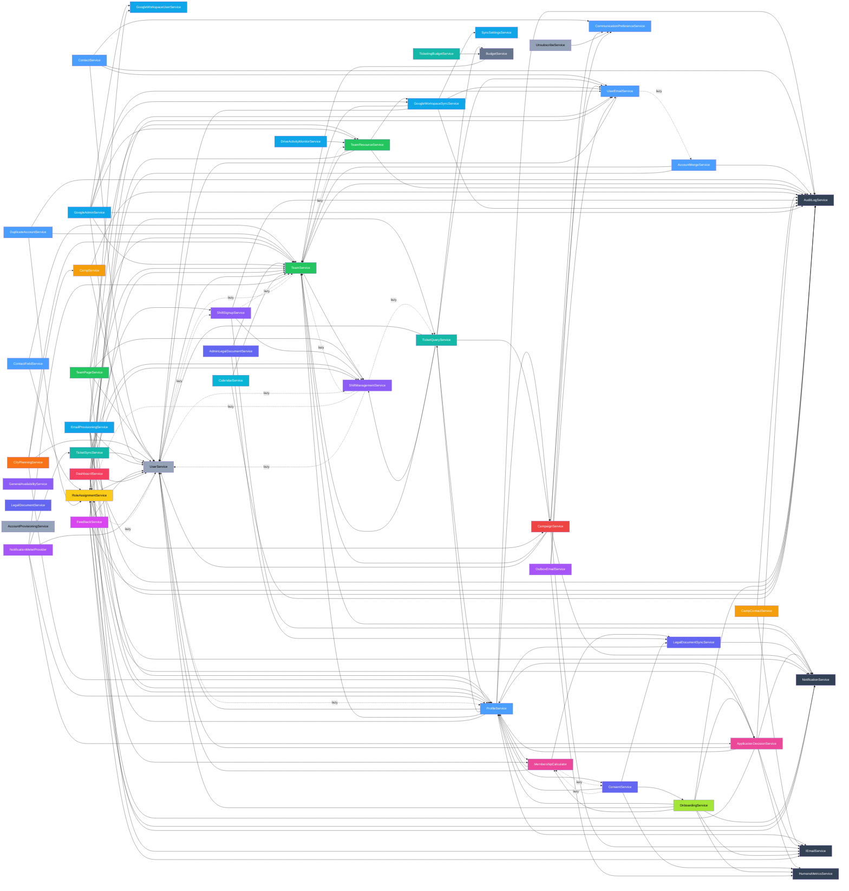

# Service Dependency Graph

Directed graph of service-to-service dependencies, reflecting the post-§15 Part 1 migration state (assumes Wave 3 of the 2026-04-23 cleanup plan is complete — see `docs/architecture/tech-debt-2026-04-23.md`).

## How to read

- Solid arrow (`-->`) = ctor-injected dependency, eagerly resolved.
- Dashed arrow labelled `(lazy)` = resolved on-demand via `IServiceProvider.GetRequiredService<T>()`. This pattern breaks DI cycles where two services legitimately call each other.
- Cross-cutting services (AuditLog, Email, Notification, RoleAssignment, HumansMetrics) are shown separately to reduce noise.
- Intra-section edges are omitted when they don't cross a section boundary.

## Mermaid diagram

## Cycles broken by lazy-resolution

The `IServiceProvider` + property-getter lazy-resolution pattern is used at ~7 sites to break otherwise-intractable DI cycles. Each pair below would fail constructor injection if both sides tried to eager-inject the other:

1. **Team ↔ User** — TeamService lazy-resolves `IUserService` for user-slice stitching; UserService eagerly injects `ITeamService` for nav invalidation.
2. **User ↔ Profile** — UserService lazy-resolves `IProfileService` for full-profile reads triggered by user edits; ProfileService eagerly injects `IUserService` for identity lookups.
3. **User ↔ Role** — UserService lazy-resolves `IRoleAssignmentService` for role-claim invalidation; RoleAssignmentService eagerly injects `IUserService`.
4. **User ↔ Shifts (both)** — UserService lazy-resolves `IShiftManagementService` and `IShiftSignupService` for authorization cache invalidation on user changes; both shift services eagerly inject `IUserService` via their own service-provider lazy-resolution.
5. **Shifts ↔ Team** — ShiftManagementService lazy-resolves `ITeamService` (and ShiftSignupService does too); TeamService eagerly injects `IShiftManagementService`.
6. **Shifts ↔ Role** — ShiftManagementService lazy-resolves `IRoleAssignmentService`.
7. **Shifts ↔ TicketQuery** — ShiftManagementService lazy-resolves `ITicketQueryService` (ticket-holder → shift-eligibility lookups).
8. **Consent ↔ MembershipCalculator** — ConsentService lazy-resolves `IMembershipCalculator` for status recomputes; MembershipCalculator lazy-resolves `IConsentService` for required-docs-given checks. Both sides are lazy because this cycle is two-way hot.
9. **UserEmail ↔ AccountMerge** — UserEmailService lazy-resolves `IAccountMergeService` for merge-driven email reparenting; AccountMergeService eagerly injects `IUserEmailRepository` (not the service) to avoid the reverse edge entirely.

When adding a new cross-service call, default to ctor injection. Reach for the lazy pattern only when ctor injection produces a circular DI error, and document why at the call site.

## Fan-in hotspots (most depended-on services)

| Service | Eager dependents | Lazy dependents | Notes |
|---------|-----------------:|----------------:|-------|
| `AuditLogService` | 16 | 0 | Cross-cutting — every write-path service logs audit events. No-op alternative: audit decorator (rejected; audit is in-service per §7a). |
| `UserService` | 15 | 4 | Largest fan-in. Expose efficient batch methods (`GetByIdsAsync`) to avoid N+1 at call sites. |
| `TeamService` | 14 | 2 | Second-largest fan-in. Same batch-method guidance. |
| `NotificationService` | 8 | 0 | Cross-cutting notifications. |
| `RoleAssignmentService` | 6 | 2 | Auth hub. |
| `IEmailService` | 6 | 0 | Abstract over SmtpEmailService + OutboxEmailService. |
| `ProfileService` | 9 | 1 | Biggest Profile consumer is ProfileService itself (full-profile stitching). |
| `HumansMetricsService` | 4 | 0 | Invoked from Application services that emit counter events (ConsentService, OnboardingService, AppDec, OutboxEmail). Scheduled for push-model inversion in #580 — after that, HumansMetricsService becomes zero-section-knowledge infrastructure. |
| `TeamResourceService` | 3 | 0 | Teams-owned Google resources. |
| `ShiftManagementService` | 5 | 1 | Shift hub. |
| `CampService` | 1 | 0 | Only CityPlanning reads it. |

## Notes on architectural follow-ups

- **#580** — `HumansMetricsService` push-model inversion: sections register their own metrics instead of the service spidering across every section. After that lands, the current `Metrics` node becomes pure registry infrastructure with zero outgoing edges.
- **#581** — `NotificationMeterProvider` push-model inversion: same pattern as #580 for the navbar-badge meter counts. Post-inversion, `NotifMeter` has zero outgoing edges.
- **#570** — final slice (Google-writing jobs through service interfaces) doesn't change service→service edges; it affects Job → Service edges, which aren't part of this graph.
- The Profile section owns `FullProfile` and `IFullProfileInvalidator` as its canonical stitched-DTO implementation of §15. Other sections apply §15's caching decorator and `Full<X>` DTO layers selectively (not universally), as stitching demand warrants.
