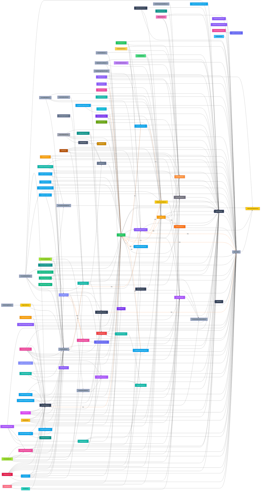

# Service Dependency Graph

Directed graph of **cross-section** service-to-service dependencies. Intra-section edges are
omitted by design — a section's internal wiring belongs to the section; this map shows the
coupling between sections.

## How to read

- Solid black arrow (`-->`) = ctor-injected dependency, eagerly resolved.
- Dashed orange arrow labelled `(lazy)` = resolved on-demand via `IServiceProvider.GetRequiredService<T>()` / `Lazy<T>`. This pattern breaks DI cycles where two services legitimately call each other. A healthy graph minimizes them.
- Read-split interfaces: edges into a section that read through its `I<Section>ServiceRead` boundary are collapsed onto the owning service node. The node names the full service; the read interface is the cross-section consumption surface.
- Services with zero cross-section service edges don't appear in the diagram; they are listed under "Services with no cross-section edges" below so the verifier can account for every service.
- Fan-out contributor interfaces (`IEnumerable<ICalendarFeedContributor>`, `IEarlyEntryProvider`, `IEventSettingsChangeListener`, `IMailerLiteAudience`, `IUserMerge`, `IUserDataContributor`) are not drawn as edges — each implementation's own deps are.

## Mermaid diagram

```mermaid
graph LR
    %% ── Section colors ──
    classDef profiles fill:#4a9eff,color:#fff
    classDef teams fill:#22c55e,color:#fff
    classDef camps fill:#f59e0b,color:#fff
    classDef cantina fill:#fcd34d,color:#000
    classDef cityplanning fill:#f97316,color:#fff
    classDef shifts fill:#8b5cf6,color:#fff
    classDef governance fill:#ec4899,color:#fff
    classDef legal fill:#6366f1,color:#fff
    classDef consent fill:#818cf8,color:#fff
    classDef tickets fill:#14b8a6,color:#fff
    classDef campaigns fill:#ef4444,color:#fff
    classDef google fill:#0ea5e9,color:#fff
    classDef monitor fill:#0369a1,color:#fff
    classDef onboarding fill:#a3e635,color:#000
    classDef feedback fill:#d946ef,color:#fff
    classDef auth fill:#facc15,color:#000
    classDef users fill:#94a3b8,color:#000
    classDef budget fill:#64748b,color:#fff
    classDef calendar fill:#06b6d4,color:#fff
    classDef dashboard fill:#f43f5e,color:#fff
    classDef notifications fill:#a855f7,color:#fff
    classDef email fill:#0d9488,color:#fff
    classDef mailerlite fill:#10b981,color:#fff
    classDef search fill:#fb7185,color:#fff
    classDef issues fill:#fbbf24,color:#000
    classDef store fill:#7c3aed,color:#fff
    classDef expenses fill:#9ca3af,color:#000
    classDef finance fill:#475569,color:#fff
    classDef containers fill:#4ade80,color:#000
    classDef events fill:#2dd4bf,color:#000
    classDef earlyentry fill:#fb923c,color:#fff
    classDef settings fill:#71717a,color:#fff
    classDef surveys fill:#0ea5e9,color:#fff
    classDef icalfeed fill:#38bdf8,color:#000
    classDef monitor fill:#c084fc,color:#000
    classDef gate fill:#b45309,color:#fff
    classDef holded fill:#ca8a04,color:#fff
    classDef guide fill:#65a30d,color:#fff
    classDef rideshare fill:#f472b6,color:#000
    classDef workgroups fill:#e11d48,color:#fff
    classDef crosscut fill:#334155,color:#fff
    classDef platform fill:#52525b,color:#fff

    %% ── Cross-cutting services (hub) ──
    Audit[AuditLogService]:::crosscut
    Email[OutboxEmailService]:::crosscut
    Notif[NotificationService]:::crosscut
    Role[RoleAssignmentService]:::auth
    Metrics[HumansMetricsService]:::crosscut

    %% ── Section services (only those with cross-section edges) ──
    Backdoor[BackdoorApiKeyService]:::crosscut

    User[UserService]:::users
    UEmail[UserEmailService]:::users
    CommPref[CommunicationPreferenceService]:::users
    CF[ContactFieldService]:::users
    AcctProv[AccountProvisioningService]:::users
    AcctDel[AccountDeletionService]:::users
    UserParticipationBackfill[UserParticipationBackfillService]:::users
    Merge[AccountMergeService]:::users
    DupAcct[DuplicateAccountService]:::users
    ExtLogin[ExternalLoginService]:::users
    UsersAudience[UsersAudienceService]:::users
    HumanLifecycle[HumanLifecycleService]:::users
    TeamMsgOpts[TeamMessageOptionsProvider]:::users

    AdminAuth[AdminAuthorizationService]:::auth
    MagicLink[MagicLinkService]:::auth

    Team[TeamService]:::teams
    TPage[TeamPageService]:::teams

    Camp[CampService]:::camps
    CampContact[CampContactService]:::camps
    CampRole[CampRoleService]:::camps

    Cantina[CantinaRosterService]:::cantina

    CityPlan[CityPlanningService]:::cityplanning

    ShiftMgmt[ShiftManagementService]:::shifts
    ShiftSign[ShiftSignupService]:::shifts
    VolTrack[VolunteerTrackingService]:::shifts
    VolTrackExport[VolunteerTrackingExportService]:::shifts
    ShiftView[ShiftViewService]:::shifts
    RotaMsg[RotaCoordinatorMessageService]:::shifts
    Workload[WorkloadService]:::shifts

    AppDec[ApplicationDecisionService]:::governance
    MembershipCalc[MembershipCalculator]:::governance
    MemQuery[MembershipQuery]:::governance
    GovIndex[GovernanceIndexService]:::governance
    AssemblyVote[AssemblyVoteService]:::governance

    LegalDoc[LegalDocumentService]:::legal
    LegalSync[LegalDocumentSyncService]:::legal
    Consent[ConsentService]:::consent
    LegalSyncRunner[LegalDocumentSyncRunner]:::consent

    TicketQ[TicketQueryService]:::tickets
    TicketSync[TicketSyncService]:::tickets
    TicketTransfer[TicketTransferService]:::tickets
    AttendeeImport[AttendeeContactImportService]:::tickets
    OnsiteRoster[OnsiteRosterService]:::tickets
    TicketVendor[TicketVendorGateway]:::tickets

    TicketTailor[TicketVendorService]:::tickets

    Stripe[StripeService]:::store

    Campaign[CampaignService]:::campaigns

    GSyncSvc[GoogleWorkspaceSyncService]:::google
    GGroupSync[GoogleGroupSyncService]:::google
    GAdmin[GoogleAdminService]:::google
    GDriveAccess[GoogleDriveAccessSyncService]:::google
    EmailProv[EmailProvisioningService]:::google
    GRemoval[GoogleRemovalNotificationService]:::google
    GSyncOutbox[GoogleSyncOutboxService]:::google
    GSyncOutboxProc[GoogleSyncOutboxProcessor]:::google
    GTrans[GoogleTranslationService]:::google
    GSyncHistMig[GoogleSyncHistoryMigrationService]:::google
    GSyncLog[GoogleSyncLogService]:::google
    TRes[TeamResourceService]:::google

    DriveMon[DriveActivityMonitorService]:::monitor

    Onboard[OnboardingService]:::onboarding
    OnboardWidget[OnboardingWidgetState]:::onboarding

    Feedback[FeedbackService]:::feedback

    Budget[BudgetService]:::budget
    TicketBudget[TicketingBudgetService]:::budget

    Finance[FinanceService]:::finance

    Holded[HoldedService]:::holded

    Cal[CalendarService]:::calendar
    ICalFeed[ICalFeedService]:::icalfeed

    EmailOutbox[EmailOutboxService]:::email
    EmailOutboxProc[EmailOutboxProcessor]:::email
    ComposerSelfSend[ComposerSelfSendService]:::email
    EmailPreview[EmailPreviewService]:::email

    NotifEmitter[NotificationEmitter]:::notifications
    NotifInbox[NotificationInboxService]:::notifications
    NotifMeter[NotificationMeterProvider]:::notifications

    Gdpr[GdprService]:::crosscut

    Search[SearchService]:::search

    Issues[IssuesService]:::issues

    Store[StoreAccountingRead]:::store

    ExpenseReport[ExpenseReportService]:::expenses

    Container[ContainerService]:::containers

    MailerLiteSync[MailerLiteAudienceSyncService]:::mailerlite
    MailerLiteImport[MailerLiteImportService]:::mailerlite
    MailerLiteGdpr[MailerLiteGdprContributor]:::mailerlite

    EventSvc[EventService]:::events

    EarlyEntry[EarlyEntryService]:::earlyentry

    Gate[GateService]:::gate

    Survey[SurveyService]:::surveys
    SurveyPrevEmail[SurveyPreviewEmailService]:::surveys

    SettingsSvc[SettingsWriteService]:::settings

    Guide[GuideRoleResolver]:::guide

    Rideshare[RideshareService]:::rideshare

    Workgroup[WorkgroupService]:::workgroups

    %% ═══════════════════════════════════
    %% Ctor-injected dependencies (solid)
    %% ═══════════════════════════════════

    %% AuditLog
    Audit --> User

    %% Backdoor
    Backdoor --> Audit
    Backdoor --> Role
    Backdoor --> User

    %% Users
    User --> AdminAuth
    UEmail --> Audit
    CommPref --> Audit
    CF --> Role
    CF --> Team
    AcctProv --> Audit
    AcctDel --> Audit
    AcctDel --> Email
    AcctDel --> Role
    AcctDel --> Team
    AcctDel --> ShiftMgmt
    AcctDel --> ShiftView
    AcctDel --> TicketQ
    AcctDel --> Gdpr
    UserParticipationBackfill --> SettingsSvc
    Merge --> Audit
    Merge --> Notif
    Merge --> Role
    Merge --> Consent
    DupAcct --> Audit
    DupAcct --> Role
    DupAcct --> Team
    ExtLogin --> MagicLink
    UsersAudience --> TicketQ
    HumanLifecycle --> Audit
    HumanLifecycle --> Metrics
    HumanLifecycle --> NotifEmitter
    HumanLifecycle --> NotifInbox
    TeamMsgOpts --> Team
    TeamMsgOpts --> TRes

    %% Auth
    Role --> Audit
    Role --> User
    Role --> NotifEmitter
    MagicLink --> Email
    MagicLink --> User
    MagicLink --> UEmail

    %% Teams
    Team --> Audit
    Team --> AdminAuth
    Team --> ShiftMgmt
    Team --> NotifEmitter
    Team --> EarlyEntry
    TPage --> User
    TPage --> ShiftMgmt
    TPage --> TRes
    TPage --> SettingsSvc

    %% Camps
    Camp --> Audit
    Camp --> User
    Camp --> NotifEmitter
    Camp --> EarlyEntry
    Camp --> SettingsSvc
    CampContact --> Audit
    CampContact --> Email
    CampContact --> NotifEmitter
    CampRole --> Audit
    CampRole --> User
    CampRole --> UEmail
    CampRole --> NotifEmitter

    %% Cantina
    Cantina --> User
    Cantina --> ShiftMgmt
    Cantina --> SettingsSvc

    %% CityPlanning
    CityPlan --> Audit
    CityPlan --> User
    CityPlan --> Team
    CityPlan --> Camp

    %% Shifts
    ShiftMgmt --> Audit
    ShiftMgmt --> AdminAuth
    ShiftSign --> Audit
    ShiftSign --> User
    ShiftSign --> AdminAuth
    ShiftSign --> NotifEmitter
    ShiftSign --> EarlyEntry
    VolTrack --> User
    VolTrackExport --> User
    RotaMsg --> Audit
    RotaMsg --> Email
    RotaMsg --> User
    RotaMsg --> Team
    Workload --> User
    Workload --> Team

    %% Governance
    AppDec --> Audit
    AppDec --> Email
    AppDec --> Role
    AppDec --> Metrics
    AppDec --> User
    AppDec --> UEmail
    AppDec --> NotifEmitter
    MembershipCalc --> User
    MembershipCalc --> LegalSync
    MemQuery --> Role
    MemQuery --> Team
    GovIndex --> User
    GovIndex --> LegalDoc
    AssemblyVote --> Audit
    AssemblyVote --> Email
    AssemblyVote --> Role
    AssemblyVote --> User
    AssemblyVote --> UEmail
    AssemblyVote --> Team
    AssemblyVote --> GTrans
    AssemblyVote --> NotifEmitter
    AssemblyVote --> NotifInbox

    %% Consent
    LegalSync --> User
    LegalSync --> Team
    LegalSync --> NotifEmitter
    Consent --> Metrics
    Consent --> User
    Consent --> HumanLifecycle
    Consent --> NotifInbox
    LegalSyncRunner --> Email
    LegalSyncRunner --> User
    LegalSyncRunner --> Team

    %% Tickets
    TicketQ --> User
    TicketQ --> UEmail
    TicketQ --> Team
    TicketQ --> Campaign
    TicketQ --> Budget
    TicketQ --> SettingsSvc
    TicketSync --> User
    TicketSync --> TicketTailor
    TicketSync --> Stripe
    TicketSync --> Campaign
    TicketSync --> SettingsSvc
    TicketTransfer --> Audit
    TicketTransfer --> Email
    TicketTransfer --> User
    TicketTransfer --> UEmail
    TicketTransfer --> TicketTailor
    AttendeeImport --> Audit
    AttendeeImport --> User
    AttendeeImport --> UEmail
    AttendeeImport --> AcctProv
    AttendeeImport --> SettingsSvc
    OnsiteRoster --> Role
    OnsiteRoster --> User
    OnsiteRoster --> Team
    OnsiteRoster --> Camp
    TicketVendor --> TicketTailor

    %% Campaigns
    Campaign --> Email
    Campaign --> User
    Campaign --> UEmail
    Campaign --> Team
    Campaign --> TicketVendor
    Campaign --> NotifEmitter

    %% GoogleIntegration
    GSyncSvc --> Audit
    GSyncSvc --> User
    GSyncSvc --> UEmail
    GSyncSvc --> Team
    GGroupSync --> Audit
    GGroupSync --> User
    GGroupSync --> UEmail
    GGroupSync --> Team
    GAdmin --> Audit
    GAdmin --> User
    GAdmin --> UEmail
    GAdmin --> Team
    GDriveAccess --> Audit
    GDriveAccess --> User
    GDriveAccess --> UEmail
    EmailProv --> Audit
    EmailProv --> Email
    EmailProv --> User
    EmailProv --> UEmail
    EmailProv --> Team
    EmailProv --> NotifEmitter
    GRemoval --> Email
    GRemoval --> User
    GRemoval --> UEmail
    GSyncOutboxProc --> Metrics
    GSyncOutboxProc --> User
    GSyncOutboxProc --> Team
    GSyncHistMig --> Audit
    GSyncLog --> User
    GSyncLog --> UEmail
    TRes --> Audit
    TRes --> Team

    %% Monitor
    DriveMon --> Audit
    DriveMon --> User
    DriveMon --> TRes
    DriveMon --> SettingsSvc

    %% Onboarding
    Onboard --> Audit
    Onboard --> Email
    Onboard --> User
    Onboard --> HumanLifecycle
    Onboard --> AppDec
    Onboard --> MembershipCalc
    Onboard --> Consent
    Onboard --> NotifEmitter
    OnboardWidget --> User
    OnboardWidget --> ShiftView
    OnboardWidget --> MembershipCalc
    OnboardWidget --> Consent
    OnboardWidget --> SettingsSvc

    %% Feedback
    Feedback --> Audit
    Feedback --> Email
    Feedback --> User
    Feedback --> UEmail
    Feedback --> Team
    Feedback --> NotifEmitter

    %% Budget
    Budget --> User
    Budget --> Team
    TicketBudget --> TicketQ

    %% Finance
    Finance --> Audit
    Finance --> Budget
    Finance --> Holded

    %% Calendar
    Cal --> Audit
    ICalFeed --> User

    %% Email
    Email --> Metrics
    Email --> UEmail
    Email --> CommPref
    EmailOutbox --> SettingsSvc
    EmailOutboxProc --> Metrics
    EmailOutboxProc --> Campaign
    ComposerSelfSend --> Audit
    ComposerSelfSend --> User
    ComposerSelfSend --> UEmail

    %% Notifications
    Notif --> Role
    Notif --> CommPref
    NotifEmitter --> CommPref
    NotifInbox --> User
    NotifMeter --> User
    NotifMeter --> Team
    NotifMeter --> Camp
    NotifMeter --> AppDec
    NotifMeter --> TicketSync
    NotifMeter --> GSyncSvc

    %% Gdpr
    Gdpr --> User

    %% Search
    Search --> User
    Search --> Team
    Search --> Camp
    Search --> ShiftMgmt
    Search --> EventSvc

    %% Issues
    Issues --> Audit
    Issues --> Email
    Issues --> Role
    Issues --> User
    Issues --> UEmail
    Issues --> NotifEmitter
    Issues --> NotifInbox

    %% Store
    Store --> Audit
    Store --> Team
    Store --> Camp
    Store --> Stripe
    Store --> SettingsSvc

    %% Expenses
    ExpenseReport --> Audit
    ExpenseReport --> User
    ExpenseReport --> Team
    ExpenseReport --> Budget
    ExpenseReport --> Finance

    %% Containers
    Container --> Audit
    Container --> Camp

    %% MailerLite
    MailerLiteSync --> Audit
    MailerLiteSync --> UEmail
    MailerLiteImport --> Audit
    MailerLiteImport --> User
    MailerLiteImport --> UEmail
    MailerLiteImport --> CommPref
    MailerLiteImport --> AcctProv
    MailerLiteGdpr --> UEmail

    %% Events
    EventSvc --> Email
    EventSvc --> User
    EventSvc --> SettingsSvc

    %% Gate
    Gate --> Audit
    Gate --> Role
    Gate --> User
    Gate --> ShiftMgmt
    Gate --> TicketQ
    Gate --> EarlyEntry
    Gate --> SettingsSvc

    %% Surveys
    Survey --> Audit
    Survey --> Email
    Survey --> User
    Survey --> UEmail
    Survey --> Team
    Survey --> ShiftView
    Survey --> TicketQ
    Survey --> GTrans
    SurveyPrevEmail --> Email
    SurveyPrevEmail --> User
    SurveyPrevEmail --> UEmail
    SurveyPrevEmail --> EmailPreview

    %% Settings
    SettingsSvc --> Audit

    %% Guide
    Guide --> Team
    Guide --> Camp

    %% Rideshare
    Rideshare --> Audit
    Rideshare --> User
    Rideshare --> NotifEmitter
    Rideshare --> SettingsSvc

    %% Workgroups
    Workgroup --> Audit
    Workgroup --> Email
    Workgroup --> Notif
    Workgroup --> Role
    Workgroup --> User
    Workgroup --> UEmail
    Workgroup --> GSyncSvc
    Workgroup --> Survey
    Workgroup --> SettingsSvc

    %% ═══════════════════════════════════
    %% Lazy-resolved (IServiceProvider/Lazy<T>) — break DI cycles
    %% ═══════════════════════════════════

    Metrics -. "lazy" .-> User
    UEmail -. "lazy" .-> TicketQ
    Team -. "lazy" .-> Email
    Team -. "lazy" .-> Role
    Team -. "lazy" .-> User
    Team -. "lazy" .-> GSyncSvc
    Team -. "lazy" .-> GSyncOutbox
    Team -. "lazy" .-> TRes
    Camp -. "lazy" .-> CityPlan
    ShiftMgmt -. "lazy" .-> Role
    ShiftMgmt -. "lazy" .-> User
    ShiftMgmt -. "lazy" .-> Team
    ShiftMgmt -. "lazy" .-> Camp
    ShiftMgmt -. "lazy" .-> TicketQ
    ShiftSign -. "lazy" .-> Team
    MembershipCalc -. "lazy" .-> Consent
    Consent -. "lazy" .-> MembershipCalc
    TRes -. "lazy" .-> Role
    Cal -. "lazy" .-> Team

    %% ── Edge styling ──
    %% 300 eager edges (indices 0..299) then 19 lazy edges; linkStyle indexes the lazy block by position.
    %% Recompute the indices whenever edges change.
    linkStyle 300,301,302,303,304,305,306,307,308,309,310,311,312,313,314,315,316,317,318 stroke:#f97316,stroke-width:2.5px
```

## Services with no cross-section edges

Not drawn above — their collaborators are all section-internal (or fan-out contributor
interfaces / infra connectors, which this graph doesn't chart):

`AdminDatabaseDiagnosticsService` (repository only), `AgentService`, `AgentAdminStatusService`,
`AgentSettingsService`, `AgentAnthropicBalanceProvider`, `AuditViewerService` (fans
`IEntityNameContributor`), `BurnSettingsService`, `CalendarFeedTokenService` (Calendar's own
repository only), `EmailProblemsService`, `GoogleWorkspaceUserService`, `GuideContentService`,
`MailerLiteService`, `NotificationInboxRead` (composes Notifications' own inbox + meter provider),
`ProfileService`, `SyncSettingsService`, `UnsubscribeService`, `UserNameSyncService`.

## Cycles broken by lazy-resolution

Each pair below would fail constructor injection if both sides eager-injected the other.

1. **ShiftManagement ↔ Team** — ShiftManagementService lazy-resolves `ITeamServiceRead`; TeamService eagerly injects `IShiftAuthorizationInvalidator` (implemented by ShiftManagementService). (ShiftSignupService also lazy-resolves `ITeamServiceRead`.)
2. **Consent ↔ MembershipCalculator** — ConsentService lazy-resolves `IMembershipCalculatorRead` for status recomputes; MembershipCalculator lazy-resolves `IConsentServiceRead` for required-docs-given checks. Both lazy because the cycle is two-way hot.
3. **Team ↔ TeamResource** — TeamService lazy-resolves `ITeamResourceService`; TeamResourceService eagerly injects `ITeamServiceRead`.
4. **Team ↔ GoogleWorkspaceSync** — TeamService lazy-resolves `IGoogleSyncService` for ad-hoc Drive/Group reconciliation; GoogleWorkspaceSyncService eagerly injects `ITeamServiceRead`.
5. **Camp ↔ CityPlanning** — CampService holds `Lazy<ICityPlanningService>` to delete a camp's polygon/history rows inside the camp-deletion transaction; CityPlanningService eagerly injects `ICampServiceRead`.
6. **UserEmail ↔ Tickets** — UserEmailService lazy-resolves `ITicketServiceRead` for the email delete-guard (nobodies-collective/Humans#758); TicketQueryService eagerly injects `IUserEmailService`.

Other notable one-way lazy edges:

- **Team → User** — user-slice stitching; User no longer reaches back into Team.
- **Team → GoogleSyncOutbox** — enqueues transactional-outbox Google-sync events on membership/role changes; one-way.
- **ShiftManagement → Role / User / Camp / Tickets**, **Team → Role / Email**, **TeamResource → Role** — one-way lazy where eager injection would still close a cycle through other paths (notably `ISystemTeamSync`, a job interface outside this graph).
- **Calendar → Team**, **HumansMetrics → User** — Singleton hosts (the `CachingCalendarService` decorator, the polled metrics gauge) resolving a scoped read service per call, not cycle breaks.

When adding a new cross-service call, default to ctor injection. Reach for the lazy pattern only when ctor injection produces a circular DI error, and document why at the call site.

## Fan-in hotspots

The most depended-on cross-section surfaces (read the counts off the diagram):

- **`UserService`** — largest fan-in by far; nearly every section reads users through `IUserServiceRead`. No outbound edges except `IAdminAuthorizationService`, which is what keeps it foundational.
- **`AuditLogService`** — every write-path service logs audit events (in-service per design-rules §7a, not a decorator).
- **`TeamService`** — second-largest section fan-in; read consumers go through `ITeamServiceRead`; batch methods exist to avoid N+1 at call sites.
- **`UserEmailService`** — email-identity lookups across the system.
- **`OutboxEmailService`** (`IEmailService`) / **`CommunicationPreferenceService`** — outbound mail and its consent/unsubscribe gating.
- **`NotificationEmitter`** — the enqueue surface almost all notifiers inject; only `AccountMergeService` and `WorkgroupService` take the full `INotificationService`.
- **`SettingsWriteService`** (`ISettingsService`) — event/app settings read by most event-facing sections.
- **`ShiftManagementService`** — shift hub; itself lazy-resolves Team/Role/Tickets/User/Camp to break cycles.
- **`AdminAuthorizationService`**, **`ShiftViewService`** — repo-only adapters with zero outbound cross-section edges.

## Pending follow-ups

- **#580 / #581** — `HumansMetricsService` and `NotificationMeterProvider` push-model inversions: sections register their own metrics/meters instead of the hub spidering across sections. Post-inversion, `Metrics` and `NotifMeter` have zero outgoing edges.
- **GoogleIntegration consumer-side gaps (PR #500)** — (1) AuditLog reads `GoogleResource` via a nav + `.Include` instead of `ITeamResourceService.GetResourceNamesByIdsAsync`; (2) Teams still owns the `GoogleResource.Team` cross-domain nav (strip → typed FK); (3) Users/Profiles should expose `IUserEmailService.InvalidateNobodiesTeamEmailsAsync()` so `GoogleController`/`ProfileController` can drop their `IMemoryCache` injection.
