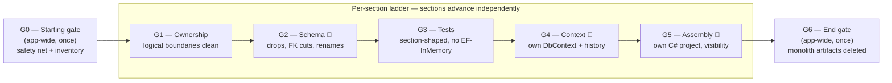
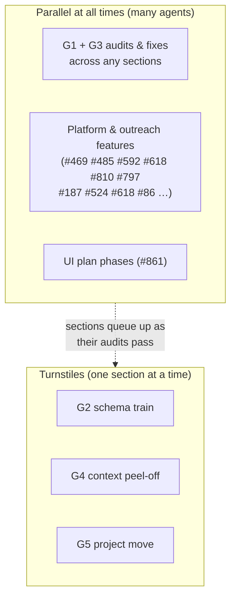
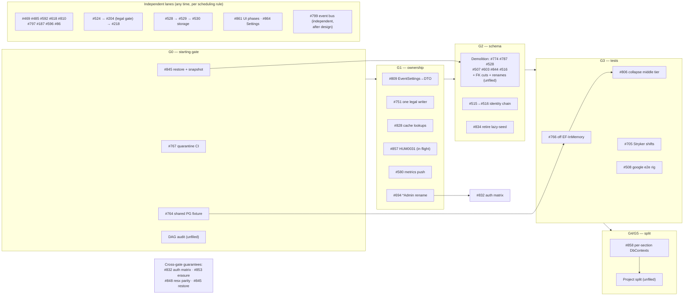

# Q3-2026 Transition Plan — Gates, Map, Destination

> **Status:** Plan of record for Q3-2026 (post-event quarter). Drafted 2026-06-13 from the
> 45 open `schedule:q3-2026` issues plus Peter's program framing. Companion to the
> [Q3 UI refactoring plan](2026-06-11-q3-ui-refactoring-plan.md) (which is one workstream
> inside this one, tracked as nobodies-collective/Humans#861).
>
> **How to use:** Sections move through the gate ladder below one gate at a time. Audits
> are parallel across sections; migration-bearing gates are turnstiles (one section at a
> time). A `/section-gate` skill (to be built — sketch at the end) institutionalizes the
> gate checklists so multiple agents can drive sections toward gates concurrently.

## The destination

Q3 ends with **a completely reworked application that has cleaned up its tech debt.**
Concretely, four pillars:

### 1. One person, one identity, one state
`User` is the single canonical person aggregate. `UserId` is the only key (#515→#516 kill
`ProfileId`); `UserEmails` is the only email store (#603, #507); stored `User.State` is the
only access state (#834, #844 kill the classifier and `ProfileState`); the warmed
`UserInfo` cache is the only person-read path (#828).

### 2. Sections become projects — the constitution becomes the compiler
The destructive-DB moratorium lifts in Q3. Everything queued behind it — cross-section FK
constraints, dead columns, legacy tables — is cleaned up in one careful pass. On the clean
schema, each section gets its own EF DbContext and migration history (#858), tables are
renamed to section prefixes, and finally **each section becomes its own C# project**:
database layer, repositories, services, and controllers in one vertical assembly.

- Cross-section dependencies become assembly references; circular dependencies become
  compile errors, not analyzer findings.
- Proper `public`/`internal` visibility replaces the read-interface workarounds. The public
  surface of a section *is* its contract.
- **Allowed exceptions, kept to a minimum:** horizontal services (Auth, Audit) and
  things genuinely used everywhere (User/`UserInfo`) may live upstream as shared public
  contracts, which lets conceptually-mutual references exist without breaking the model.
  These are the exception, not the rule — nothing else gets broken out unless it has to be.
- Most HUM00xx call-site analyzers, the architecture-test baselines, and the
  `[Grandfathered]` machinery become redundant — the compiler enforces what they policed.
- Each section becomes small enough to hold in one head — human or LLM.

### 3. Guarantees enforced by failing builds, not review
Rebuilt test pyramid (#764→#766→#806; #767 bans "pre-existing failures on main"), role×route
authorization matrix (#694→#832), erasure architecture test symmetric to the export one
(#853), resx parity (#848), Google-reconciliation e2e rig (#508), mutation coverage on the
riskiest service (#705), proven DB restore (#845).

### 4. From members-only tool to the association's platform
Public/mobile UX refresh (#861; carve-outs #848, #596), newsletter → compliant marketing
opt-in → audience segmentation (#524→#204→#218), short links (#810), team-identity comms
(#618), external calendars (#592), bylaw voting (#86), self-running onboarding (#485,
#127), notifications API (#469).

Related but independent: the in-process domain-event bus (#799) will happen — it retires
the 17-interface / 34-injection-site invalidator swarm — but it is **not** a prerequisite
for the project split. Mutual-awareness cases that would otherwise cycle are handled by the
shared-contract exception above.

## The gate ladder

Each gate is a set of auditable predicates. A section is "at gate N" when every predicate
of N (and all earlier gates) holds. **G0 and G6 are app-wide; G1–G5 are per-section.**



🚧 = **migration/move turnstile**: only one section at a time may be inside this gate's
execution (EF migration train for G2/G4; file-move conflict surface for G5). G1 and G3
work is parallel-safe across any number of sections/agents.

### G0 — Starting gate (app-wide, once)

The safety net plus the map. Nothing destructive starts before G0 closes.

- [ ] **Restore proven:** runbook committed to `docs/`, restore exercised end-to-end into a
      scratch target (#845).
- [ ] **Pre-deploy snapshot** wired in front of schema-changing deploys (#845).
- [ ] **Quarantine discipline:** CI fails on `Skip=` without a tracking issue ref (#767).
- [ ] **Integration tests trustworthy as a net:** shared Postgres fixture (#764) landed;
      suite green on main.
- [ ] **Section inventory frozen:** the tracker table below confirmed as the canonical
      section list (additions/merges decided now, not mid-flight).
- [ ] **Dependency DAG computed:** Reforge-derived section→section call graph (service
      calls, invalidator injections, read-interface consumers) committed alongside this
      plan. Shared-contract exceptions (User/UserInfo, Auth, Audit) explicitly listed;
      anything else that looks like it needs the exception gets challenged here.
- [ ] **Demolition inventory:** per-section list of dead columns/tables, cross-section FK
      constraints, and non-conforming table names (feeds G2 work items).
- [ ] **First audit pass:** every section scored against G1–G3 predicates; tracker filled.

### G1 — Ownership (per section): *your data is yours alone*

All checks mechanical (Reforge/grep/analyzer); fixes are ordinary refactors, no migrations.

- [ ] Every owned table is read/written by exactly one repository, in this section; no
      other repository or service touches it.
- [ ] One writer-service per table (#751 pattern — no interceptor workarounds).
- [ ] No section EF entity leaks across the boundary: other sections consume DTOs via the
      section's read surface only (#809 pattern).
- [ ] No cross-section EF joins (existing analyzer clean **with zero baseline entries**
      for this section).
- [ ] No `[Obsolete]` cross-section navs, no `[Grandfathered]` attributes, no
      architecture-test baseline rows owned by this section — or each remaining one has a
      queued G2 demolition item.
- [ ] Controllers thin: no HUM0031 grandfathers in this section's controllers (#857).
- [ ] `docs/sections/<Section>.md` current (invariants, table ownership, triggers).

### G2 — Schema (per section) 🚧 turnstile

The section's share of the Great Cleanup. One section at a time through the migration
train; EF migration reviewer on every PR; prod-verify before the next section enters.

- [ ] Dead columns and tables dropped (this section's demolition-inventory items — e.g.
      #774 camp_leads, #787 SQL default, #528 ProfilePictureData, #507 email vestiges,
      #603 Identity columns, #844 ProfileState, #516 ProfileId).
- [ ] Cross-section DB-level FK constraints dropped — integrity is application-level
      (bare-Guid pattern); a section's schema must stand alone.
- [ ] Tables renamed to the section prefix (paid once, on the monolithic snapshot,
      *before* G4 baselines).
- [ ] No data backfills authored (hard rule); lazy-seed paths retired where their soak
      gates pass (#834).
- [ ] Migration deployed to prod and verified; debt ledger cleared of this section's
      destructive items.

### G3 — Tests (per section): *section-shaped and honest*

Parallel-safe. This is #766's per-section batch plus the #806 conversion, gated per
section instead of as one big bang.

- [ ] Repository tests run against real Postgres (shared fixture) — zero EF-InMemory.
- [ ] Service tests mock repository/`I…ServiceRead` interfaces — zero `HumansDbContext`.
- [ ] Section invariants and triggers from `docs/sections/<Section>.md` each have a test.
- [ ] No skipped tests without a `nobodies-collective/Humans#NNN` ref.
- [ ] Tests grouped under the section (movable with it at G5).

### G4 — Context (per section) 🚧 turnstile

The section's slice of #858, peel-off style.

- [ ] `<Section>DbContext` maps exactly the owned tables; nothing else.
- [ ] Own `__EFMigrationsHistory_<section>`; baseline fake-applied across envs
      (prod, QA, previews).
- [ ] Section repositories take `<Section>DbContext`; entities removed from the
      monolithic context.
- [ ] A test migration in the section produces a small snapshot; no shared-snapshot
      conflict with parallel PRs.

### G5 — Assembly (per section) 🚧 turnstile

- [ ] Section's vertical lives in its own csproj: entities, EF configuration, DbContext,
      repositories, services, controllers, views (application parts / RCL).
- [ ] Visibility enforced: `internal` by default; `public` only the deliberate contract.
      Read-interface indirection dissolved into that contract where it was only there to
      police access.
- [ ] References only: shared/core contracts, horizontals (Auth, Audit), and downstream
      section contracts. Solution builds ⇒ the DAG holds.
- [ ] Section tests live in/with the section's test project.
- [ ] Section's rows in analyzers/baselines deleted — the compiler owns the boundary now.

### G6 — End gate (app-wide, once): *the clean state*

- [ ] All sections at G5; monolithic `HumansDbContext` deleted.
- [ ] `Architecture/Baselines` folder empty and removed; zero `[Grandfathered]`; call-site
      analyzers that the compiler now subsumes retired.
- [ ] EF-InMemory package gone; analyzer guard keeps it gone (#806).
- [ ] Hard rules and `design-rules.md` rewritten for the new physics (Peter).
- [ ] Debt ledger drained of architectural themes; remaining entries are deliberate.
- [ ] The 45 Q3 issues closed or explicitly re-scheduled with reasons.

## Parallelism model



- **Feature work scheduling rule:** a feature lands in a section either *before* that
  section enters a turnstile or *after* it exits — never concurrently.
- **db:yes features** (#864, #810, #797, #592, #485, #204, #86 …) ride the same migration
  train discipline as G2/G4 until that section is at G4 (after which its migrations are
  autonomous — that's the payoff).
- The identity chain (#515 → bake → #516), storage chain (#528 → #529 → #530), and
  campaigns chain (#204 → #218 after legal) run as their own sequenced lanes inside this
  model.

## Issue map — which gate each issue feeds



(Storage chain note: #528 is also a demolition item; #529/#530 follow it whenever it
lands. #864 follows #809 and coordinates nav with #861.)

## Gates checklist — live checks before execution

| Check | For | Status 2026-06-13 |
|-------|-----|--------------------|
| `feat/camp-roster-roles` merged + prod stable | #774 | ✅ merged 2026-05-22, soaked |
| #527 filesystem store verified in prod logs | #528 | ⏳ check fs-hit ratio |
| `users.state IS NULL` count = 0 in prod | #834 | ⏳ run against prod |
| #515 baked one business cycle in prod | #516 | ⏳ starts when #515 ships |
| Legal review (Pepe): opt-out community / opt-in marketing | #204 | ⏳ external |
| Design pass | #799 | ⏳ `blocked:needs-design` |
| Spec completion | #127 | ⏳ `blocked:spec-incomplete` |

## Section tracker

Filled by the G0 first-audit pass; updated by every `/section-gate` run. Horizontal
sections and shared contracts noted explicitly. (`—` = not yet audited.)

| Section | Kind | G1 | G2 | G3 | G4 | G5 |
|---|---|---|---|---|---|---|
| Agent | vertical | — | — | — | — | — |
| AuditLog | **horizontal** | — | — | — | — | — |
| Auth | **horizontal** | — | — | — | — | — |
| Budget | vertical | — | — | — | — | — |
| Calendar | vertical | — | — | — | — | — |
| Campaigns | vertical | — | — | — | — | — |
| Camps | vertical | — | — | — | — | — |
| Cantina | vertical | — | — | — | — | — |
| CityPlanning | vertical | — | — | — | — | — |
| Containers | vertical | — | — | — | — | — |
| Debug | **horizontal** | — | — | — | — | — |
| Email | vertical | — | — | — | — | — |
| Events | vertical | — | — | — | — | — |
| Expenses | vertical | — | — | — | — | — |
| Feedback | vertical | — | — | — | — | — |
| Finance | vertical | — | — | — | — | — |
| GoogleIntegration | vertical | — | — | — | — | — |
| Governance | vertical | — | — | — | — | — |
| Guide | vertical | — | — | — | — | — |
| Holded | vertical | — | — | — | — | — |
| Issues | vertical | — | — | — | — | — |
| LegalAndConsent | vertical | — | — | — | — | — |
| Mailer | vertical | — | — | — | — | — |
| Notifications | vertical | — | — | — | — | — |
| Onboarding | vertical (orchestrator) | — | — | — | — | — |
| Profiles | **shared contract** | — | — | — | — | — |
| Scanner | vertical | — | — | — | — | — |
| Shifts | vertical | — | — | — | — | — |
| Store | vertical | — | — | — | — | — |
| Survey | vertical | — | — | — | — | — |
| Teams | vertical | — | — | — | — | — |
| Tickets | vertical | — | — | — | — | — |
| Users | **shared contract** | — | — | — | — | — |
| *Settings (new, #864)* | vertical | n/a | n/a | — | — | — |
| *Shortlinks (new, #810)* | vertical | n/a | n/a | — | — | — |

G0 confirms this inventory (merges/splits decided then — e.g. whether Cantina/Scanner stay
separate, where admin-shell lands, whether Settings absorbs pieces of Shifts per #864).

## The `/section-gate` skill (sketch — to be built)

Institutionalizes the gate checklists so any agent applies the same definitions.

```
/section-gate <section> audit [--gate GN]     # score section against gate predicates
/section-gate <section> advance               # work the gap list for the next gate
```

- **audit** — runs the mechanical checks (Reforge surface/caller queries, analyzer +
  baseline scans, grep for entity leaks, test-filter runs, schema introspection for FK/
  naming), emits a scorecard + gap list, updates the tracker table in this doc.
- **advance** — opens a worktree, fixes the gap list for the next gate, PRs. Refuses to
  enter a 🚧 turnstile gate while another section's turnstile PR is open. Migration gates
  invoke the EF migration reviewer; G2 items respect demolition-inventory scope.
- Gate definitions live in the skill and reference this doc; changing a gate is a PR to
  both.
- Build order: audit mode first (it fills the tracker and is pure analysis); advance mode
  after the first audit wave shakes out the definitions.

## Unfiled work items (need issues)

| Item | Gate | Notes |
|------|------|-------|
| Section dependency DAG audit | G0 | Reforge-driven; lists shared-contract exceptions; pure analysis |
| Demolition inventory (dead cols/tables, cross-section FKs, table renames) | G0→G2 | The G2 work-item generator |
| Table rename pass (section prefixes) | G2 | Before G4 baselines; check raw SQL/backup tooling refs |
| Per-section project split program | G5 | Views via application parts/RCL design decision; DI composition root; shared-contracts placement |
| `/section-gate` skill | G0 | Audit mode first |

## Every Q3 issue accounted for (45/45)

| Theme | Issues |
|-------|--------|
| Identity & state | 515, 516, 603, 507, 828, 834, 844 |
| Section architecture | 858, 580, 799, 751, 809, 864, 857 |
| Verification | 761 (tracker for 764/766/767), 764, 766, 767, 806, 705, 508, 832, 694, 853, 848, 845 |
| Storage | 528, 529, 530, 187 |
| Great Cleanup (destructive) | 787, 774 (+ 528, 507, 603, 844, 516 listed above; + unfiled FK/rename) |
| Platform & outreach | 861, 596, 524, 204, 218, 810, 618, 592, 86, 469, 485, 127, 797 |
