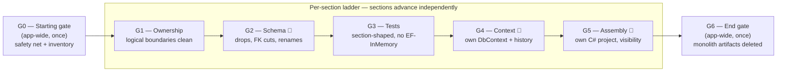
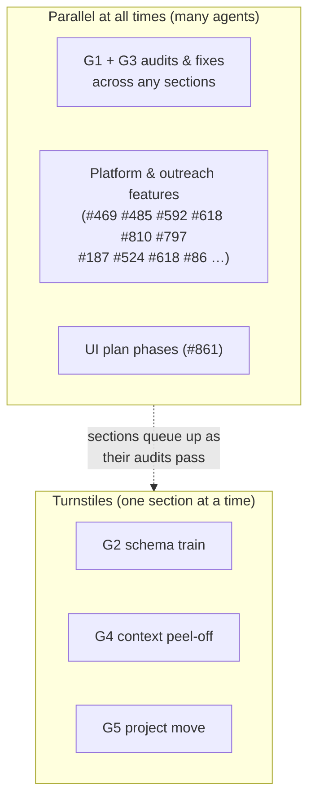
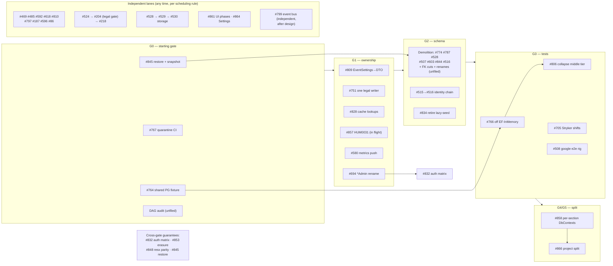

# Q3-2026 Transition Plan — Gates, Map, Destination

> **Status:** Plan of record for Q3-2026 (post-event quarter). Drafted 2026-06-13 from the
> 46 open `schedule:q3-2026` issues plus Peter's program framing. Companion to the
> [Q3 UI refactoring plan](2026-06-11-q3-ui-refactoring-plan.md) (which is one workstream
> inside this one, tracked as nobodies-collective/Humans#861).
>
> **How to use:** Sections move through the gate ladder below one gate at a time. Audits
> are parallel across sections; migration-bearing gates are turnstiles (one section at a
> time). A `/section-gate` skill (to be built — sketch at the end) institutionalizes the
> gate checklists so multiple agents can drive sections toward gates concurrently.

## The destination

Q3 ends with **a completely reworked application that has cleaned up its tech debt.**
Concretely, four pillars:

### 1. One person, one identity, one state
`User` is the single canonical person aggregate. `UserId` is the only key (#515→#516 kill
`ProfileId`); `UserEmails` is the only email store (#603, #507); stored `User.State` is the
only access state (#834, #844 kill the classifier and `ProfileState`); the warmed
`UserInfo` cache is the only person-read path (#828).

### 2. Sections become projects — the constitution becomes the compiler
The destructive-DB moratorium lifts in Q3. Everything queued behind it — cross-section FK
constraints, dead columns, legacy tables — is cleaned up in one careful pass. On the clean
schema, each section gets its own EF DbContext and migration history (#858), tables are
renamed to section prefixes, and finally **each section becomes its own C# project** (#866):
database layer, repositories, services, and controllers in one vertical assembly.

- Cross-section dependencies become assembly references; circular dependencies become
  compile errors, not analyzer findings.
- Proper `public`/`internal` visibility replaces the read-interface workarounds. The public
  surface of a section *is* its contract.
- **Allowed exceptions, kept to a minimum:** horizontal services (Auth, Audit) and
  things genuinely used everywhere (User/`UserInfo`) may live upstream as shared public
  contracts, which lets conceptually-mutual references exist without breaking the model.
  These are the exception, not the rule — nothing else gets broken out unless it has to be.
- Most HUM00xx call-site analyzers, the architecture-test baselines, and the
  `[Grandfathered]` machinery become redundant — the compiler enforces what they policed.
- Each section becomes small enough to hold in one head — human or LLM.

### 3. Guarantees enforced by failing builds, not review
Rebuilt test pyramid (#764→#766→#806; #767 bans "pre-existing failures on main"), role×route
authorization matrix (#694→#832), erasure architecture test symmetric to the export one
(#853), resx parity (#848), Google-reconciliation e2e rig (#508), mutation coverage on the
riskiest service (#705), proven DB restore (#845).

### 4. From members-only tool to the association's platform
Public/mobile UX refresh (#861; carve-outs #848, #596), newsletter → compliant marketing
opt-in → audience segmentation (#524→#204→#218), short links (#810), team-identity comms
(#618), external calendars (#592), bylaw voting (#86), self-running onboarding (#485,
#127), notifications API (#469).

Related but independent: the in-process domain-event bus (#799) will happen — it retires
the 17-interface / 34-injection-site invalidator swarm — but it is **not** a prerequisite
for the project split. Mutual-awareness cases that would otherwise cycle are handled by the
shared-contract exception above.

## The gate ladder

Each gate is a set of auditable predicates. A section is "at gate N" when every predicate
of N (and all earlier gates) holds. **G0 and G6 are app-wide; G1–G5 are per-section.**


```mermaid
flowchart LR
    G0["G0 — Starting gate<br/>(app-wide, once)<br/>safety net + inventory"]
    subgraph ladder ["Per-section ladder — sections advance independently"]
        direction LR
        G1["G1 — Ownership<br/>logical boundaries clean"]
        G2["G2 — Schema 🚧<br/>drops, FK cuts, renames"]
        G3["G3 — Tests<br/>section-shaped, no EF-InMemory"]
        G4["G4 — Context 🚧<br/>own DbContext + history"]
        G5["G5 — Assembly 🚧<br/>own C# project, visibility"]
        G1 --> G2 --> G3 --> G4 --> G5
    end
    G6["G6 — End gate<br/>(app-wide, once)<br/>monolith artifacts deleted"]
    G0 --> G1
    G5 --> G6
```

🚧 = **migration/move turnstile**: only one section at a time may be inside this gate's
execution (EF migration train for G2/G4; file-move conflict surface for G5). G1 and G3
work is parallel-safe across any number of sections/agents.

### G0 — Starting gate (app-wide, once)

The safety net plus the map. Nothing destructive starts before G0 closes.

- [ ] **Restore proven:** runbook committed to `docs/`, restore exercised end-to-end into a
      scratch target (#845).
- [ ] **Pre-deploy snapshot** wired in front of schema-changing deploys (#845).
- [ ] **Quarantine discipline:** CI fails on `Skip=` without a tracking issue ref (#767).
- [ ] **Integration tests trustworthy as a net:** shared Postgres fixture (#764) landed;
      suite green on main.
- [x] **Section inventory frozen (2026-08-03):** canonical list confirmed by Peter —
      decision record: [`2026-08-03-proposed-frozen-section-inventory.md`](2026-08-03-proposed-frozen-section-inventory.md)
      (Profiles→Users; Holded/Mailer stay as vendor connectors; Consent + Surveys naming;
      new rows Gate, Settings, Development, Gdpr, Search; Admin/Dashboard/Platform are
      not sections). Config back-propagation + new-row audits are queued follow-ups.
- [x] **Dependency DAG computed:** [`2026-08-03-section-dependency-dag.md`](2026-08-03-section-dependency-dag.md)
      (Reforge-derived; shared-contract exceptions listed; challenged edges called out).
- [x] **Demolition inventory:** [`2026-08-03-demolition-inventory.md`](2026-08-03-demolition-inventory.md)
      (per-section dead columns/tables, cross-section FKs, non-conforming table names).
- [x] **First audit pass (tracker-taxonomy scope):** all 33 sections in the tracker below
      scored against G1–G3 predicates ([`2026-08-03-g0-first-audit/`](2026-08-03-g0-first-audit/));
      tracker filled.
- [ ] **Audit the five sections admitted at the 2026-08-03 freeze:** `Gate`, `Settings`,
      `Development`, `Gdpr`, `Search` have no scorecards yet. Split out as its own gate item
      2026-08-03 — it was previously only a prose caveat on the item above, which meant the
      checklist could read complete while five canonical sections had never been scored.

### G1 — Ownership (per section): *your data is yours alone*

All checks mechanical (Reforge/grep/analyzer); fixes are ordinary refactors, no migrations.

- [ ] Every owned table is read/written by exactly one repository, in this section; no
      other repository or service touches it.
- [ ] One writer-service per table (#751 pattern — no interceptor workarounds).
- [ ] No section EF entity leaks across the boundary: other sections consume DTOs via the
      section's read surface only (#809 pattern).
- [ ] No cross-section EF joins (existing analyzer clean **with zero baseline entries**
      for this section).
- [ ] No `[Obsolete]` cross-section navs, no `[Grandfathered]` attributes, no
      architecture-test baseline rows owned by this section — or each remaining one has a
      queued G2 demolition item.
- [ ] Controllers thin: no HUM0031 grandfathers in this section's controllers (#857).
- [ ] `docs/sections/<Section>.md` current (invariants, table ownership, triggers).

### G2 — Schema (per section) 🚧 turnstile

The section's share of the Great Cleanup. One section at a time through the migration
train; EF migration reviewer on every PR; prod-verify before the next section enters.

- [ ] Dead columns and tables dropped (this section's demolition-inventory items — e.g.
      #774 camp_leads, #787 SQL default, #528 ProfilePictureData, #507 email vestiges,
      #603 Identity columns, #844 ProfileState, #516 ProfileId).
- [ ] Cross-section DB-level FK constraints dropped — integrity is application-level
      (bare-Guid pattern); a section's schema must stand alone.
- [ ] Tables renamed to the section prefix (paid once, on the monolithic snapshot,
      *before* G4 baselines).
- [ ] No data backfills authored (hard rule); lazy-seed paths retired where their soak
      gates pass (#834).
- [ ] Migration deployed to prod and verified; debt ledger cleared of this section's
      destructive items.

### G3 — Tests (per section): *section-shaped and honest*

Parallel-safe. This is #766's per-section batch plus the #806 conversion, gated per
section instead of as one big bang.

- [ ] Repository tests run against real Postgres (shared fixture) — zero EF-InMemory.
- [ ] Service tests mock repository/`I…ServiceRead` interfaces — zero `HumansDbContext`.
- [ ] Section invariants and triggers from `docs/sections/<Section>.md` each have a test.
- [ ] No skipped tests without a `nobodies-collective/Humans#NNN` ref.
- [ ] Tests grouped under the section (movable with it at G5).

### G4 — Context (per section) 🚧 turnstile

The section's slice of #858, peel-off style.

- [ ] `<Section>DbContext` maps exactly the owned tables; nothing else.
- [ ] Own `__EFMigrationsHistory_<section>`; baseline fake-applied across envs
      (prod, QA, previews).
- [ ] Section repositories take `<Section>DbContext`; entities removed from the
      monolithic context.
- [ ] A test migration in the section produces a small snapshot; no shared-snapshot
      conflict with parallel PRs.

### G5 — Assembly (per section) 🚧 turnstile

- [ ] Section's vertical lives in its own csproj: entities, EF configuration, DbContext,
      repositories, services, controllers, views (application parts / RCL).
- [ ] Visibility enforced: `internal` by default; `public` only the deliberate contract.
      Read-interface indirection dissolved into that contract where it was only there to
      police access.
- [ ] References only: shared/core contracts, horizontals (Auth, Audit), and downstream
      section contracts. Solution builds ⇒ the DAG holds.
- [ ] Section tests live in/with the section's test project.
- [ ] Section's rows in analyzers/baselines deleted — the compiler owns the boundary now.

### G6 — End gate (app-wide, once): *the clean state*

- [ ] All sections at G5; monolithic `HumansDbContext` deleted.
- [ ] `Architecture/Baselines` folder empty and removed; zero `[Grandfathered]`; call-site
      analyzers that the compiler now subsumes retired.
- [ ] EF-InMemory package gone; analyzer guard keeps it gone (#806).
- [ ] Hard rules and `design-rules.md` rewritten for the new physics (Peter).
- [ ] Debt ledger drained of architectural themes; remaining entries are deliberate.
- [ ] The 46 Q3 issues closed or explicitly re-scheduled with reasons.

## Parallelism model


```mermaid
flowchart TB
    subgraph parallel ["Parallel at all times (many agents)"]
        A["G1 + G3 audits & fixes<br/>across any sections"]
        F["Platform & outreach features<br/>(#469 #485 #592 #618 #810 #797<br/>#187 #524 #618 #86 …)"]
        U["UI plan phases (#861)"]
    end
    subgraph turnstile ["Turnstiles (one section at a time)"]
        T1["G2 schema train"]
        T2["G4 context peel-off"]
        T3["G5 project move"]
    end
    parallel -.->|"sections queue up as<br/>their audits pass"| turnstile
```

- **Feature work scheduling rule:** a feature lands in a section either *before* that
  section enters a turnstile or *after* it exits — never concurrently.
- **db:yes features** (#864, #810, #797, #592, #485, #204, #86 …) ride the same migration
  train discipline as G2/G4 until that section is at G4 (after which its migrations are
  autonomous — that's the payoff).
- The identity chain (#515 → bake → #516), storage chain (#528 → #529 → #530), and
  campaigns chain (#204 → #218 after legal) run as their own sequenced lanes inside this
  model.

## Issue map — which gate each issue feeds


```mermaid
flowchart LR
    subgraph W0 ["G0 — starting gate"]
        i845["#845 restore + snapshot"]
        i767["#767 quarantine CI"]
        i764["#764 shared PG fixture"]
        dag["DAG audit (unfiled)"]
    end
    subgraph W1 ["G1 — ownership"]
        i809["#809 EventSettings→DTO"]
        i751["#751 one legal writer"]
        i828["#828 cache lookups"]
        i857["#857 HUM0031 (in flight)"]
        i580["#580 metrics push"]
        i694["#694 *Admin rename"]
    end
    subgraph W2 ["G2 — schema"]
        demo["Demolition: #774 #787 #528<br/>#507 #603 #844 #516<br/>+ FK cuts + renames (unfiled)"]
        i515["#515→#516 identity chain"]
        i834["#834 retire lazy-seed"]
    end
    subgraph W3 ["G3 — tests"]
        i766["#766 off EF-InMemory"]
        i806["#806 collapse middle tier"]
        i705["#705 Stryker shifts"]
        i508["#508 google e2e rig"]
    end
    subgraph W4 ["G4/G5 — split"]
        i858["#858 per-section DbContexts"]
        split["#866 project split"]
    end
    cross["Cross-gate guarantees:<br/>#832 auth matrix · #853 erasure<br/>#848 resx parity · #845 restore"]
    W0 --> W1 --> W2 --> W3 --> W4
    i858 --> split
    i694 --> i832x["#832 auth matrix"]
    i845 --> demo
    i764 --> i766 --> i806

    subgraph features ["Independent lanes (any time, per scheduling rule)"]
        f1["#469 #485 #592 #618 #810<br/>#797 #187 #596 #86"]
        f2["#524 → #204 (legal gate) → #218"]
        f3["#528 → #529 → #530 storage"]
        f4["#861 UI phases · #864 Settings"]
        f5["#799 event bus (independent,<br/>after design)"]
    end
```

(Storage chain note: #528 is also a demolition item; #529/#530 follow it whenever it
lands. #864 follows #809 and coordinates nav with #861.)

## Gates checklist — live checks before execution

| Check | For | Status 2026-06-13 |
|-------|-----|--------------------|
| `feat/camp-roster-roles` merged + prod stable | #774 | ✅ merged 2026-05-22, soaked |
| #527 filesystem store verified in prod logs | #528 | ⏳ check fs-hit ratio |
| `users.state IS NULL` count = 0 in prod | #834 | ⏳ run against prod |
| #515 baked one business cycle in prod | #516 | ⏳ starts when #515 ships |
| Legal review (Pepe): opt-out community / opt-in marketing | #204 | ⏳ external |
| Design pass | #799 | ⏳ `blocked:needs-design` |
| Spec completion | #127 | ⏳ `blocked:spec-incomplete` |

## Section tracker

Filled by the G0 first-audit pass; updated by every `/section-gate` run. Horizontal
sections and shared contracts noted explicitly. (`—` = not yet audited.)

> **First audit pass completed 2026-08-03** @ `5a9bbe198`. Per-section scorecards, evidence
> and G1 gap lists: [`2026-08-03-g0-first-audit/`](2026-08-03-g0-first-audit/). Companion
> G0 artifacts: [dependency DAG](2026-08-03-section-dependency-dag.md) ·
> [demolition inventory](2026-08-03-demolition-inventory.md) ·
> [PROPOSED frozen inventory](2026-08-03-proposed-frozen-section-inventory.md).
> This table is the canonical **section list and audit index** — it deliberately carries no
> gap counts. Counts here were hand-copied out of 33 scorecards and drifted from them
> constantly; the scorecard is the single source of truth for a section's gate status, so
> read it there. G2 is not scored per-section — its queue lives in the demolition inventory.
> Taxonomy is per the **2026-08-03 inventory freeze** (decision record:
> [`2026-08-03-proposed-frozen-section-inventory.md`](2026-08-03-proposed-frozen-section-inventory.md));
> rows admitted at the freeze show `—` until their first audit pass.

| Section | Kind | First audit (gate detail lives in the scorecard) |
|---|---|---|
| Agent | vertical | [Agent](2026-08-03-g0-first-audit/Agent.md) |
| AuditLog | **horizontal** | [AuditLog](2026-08-03-g0-first-audit/AuditLog.md) |
| Auth | **horizontal** | [Auth](2026-08-03-g0-first-audit/Auth.md) |
| Budget | vertical | [Budget](2026-08-03-g0-first-audit/Budget.md) |
| Calendar (incl. ICalFeed) | vertical | [Calendar](2026-08-03-g0-first-audit/Calendar.md) |
| Campaigns | vertical | [Campaigns](2026-08-03-g0-first-audit/Campaigns.md) |
| Camps | vertical | [Camps](2026-08-03-g0-first-audit/Camps.md) |
| Cantina | vertical | [Cantina](2026-08-03-g0-first-audit/Cantina.md) |
| CityPlanning | vertical | [CityPlanning](2026-08-03-g0-first-audit/CityPlanning.md) |
| Containers | vertical | [Containers](2026-08-03-g0-first-audit/Containers.md) |
| Debug | vertical | [Debug](2026-08-03-g0-first-audit/Debug.md) |
| Development *(new 2026-08-03 — dev-only, never loaded in prod; takes DevLogin/DevSeed)* | vertical | — |
| Email | vertical | [Email](2026-08-03-g0-first-audit/Email.md) |
| Events | vertical | [Events](2026-08-03-g0-first-audit/Events.md) |
| Expenses | vertical | [Expenses](2026-08-03-g0-first-audit/Expenses.md) |
| Feedback | vertical | [Feedback](2026-08-03-g0-first-audit/Feedback.md) |
| Finance | vertical | [Finance](2026-08-03-g0-first-audit/Finance.md) |
| Gate *(new row 2026-08-03)* | vertical | — |
| Gdpr *(new row 2026-08-03)* | **orchestrator** | — |
| GoogleIntegration | **vendor connector** | [GoogleIntegration](2026-08-03-g0-first-audit/GoogleIntegration.md) |
| Governance | vertical | [Governance](2026-08-03-g0-first-audit/Governance.md) |
| Guide | vertical | [Guide](2026-08-03-g0-first-audit/Guide.md) |
| Holded | **vendor connector** | [Holded](2026-08-03-g0-first-audit/Holded.md) |
| Issues | vertical | [Issues](2026-08-03-g0-first-audit/Issues.md) |
| Consent *(renamed from LegalAndConsent)* | vertical | [LegalAndConsent](2026-08-03-g0-first-audit/LegalAndConsent.md) |
| Mailer | **vendor connector** | [Mailer](2026-08-03-g0-first-audit/Mailer.md) |
| Notifications | vertical | [Notifications](2026-08-03-g0-first-audit/Notifications.md) |
| Onboarding | **orchestrator** | [Onboarding](2026-08-03-g0-first-audit/Onboarding.md) |
| Scanner | vertical | [Scanner](2026-08-03-g0-first-audit/Scanner.md) |
| Search *(new row 2026-08-03)* | **orchestrator** | — |
| Settings *(ex-SystemSettings; absorbs #864)* | vertical | — |
| Shifts | vertical | [Shifts](2026-08-03-g0-first-audit/Shifts.md) |
| Store | vertical | [Store](2026-08-03-g0-first-audit/Store.md) |
| Surveys *(renamed from Survey)* | vertical | [Survey](2026-08-03-g0-first-audit/Survey.md) |
| Teams | vertical | [Teams](2026-08-03-g0-first-audit/Teams.md) |
| Tickets | vertical | [Tickets](2026-08-03-g0-first-audit/Tickets.md) |
| Users *(incl. Profiles — the "Humans" section)* | **shared contract** | [Users](2026-08-03-g0-first-audit/Users.md) · [Profiles](2026-08-03-g0-first-audit/Profiles.md) |
| *Shortlinks (new, #810)* | vertical | — *(does not exist yet)* |

Confirmed non-sections (never get ladder rows): **Admin** (nav holder), **Dashboard**
(GUI holder; possible future per-section `DashboardPanel` contributions), **Platform**
(dissolved config bucket). Decision record:
[`2026-08-03-proposed-frozen-section-inventory.md`](2026-08-03-proposed-frozen-section-inventory.md).
The Users row merges the former Profiles row; scorecards remain split as
[`Users.md`](2026-08-03-g0-first-audit/Users.md) / [`Profiles.md`](2026-08-03-g0-first-audit/Profiles.md).
**Arithmetic corrected 2026-08-03** (the note said "G3 combines Users 1 + Profiles 2", which
yields 3 and stopped matching the cell once `Users.md`'s G3 count was corrected 1 → 2). Both
cells are **4**, but they get there differently — the two scorecards each report 4/4, so
neither cell is a plain sum:

- **G1 = 4 — union of distinct items, deduplicated.** The scorecards' own "4"s overlap and
  sub-count differently (Users counts the two entity-leak baseline rows separately and has no
  nav item; Profiles collapses those rows but adds the navs). The union is: (1) the
  `UserInfoSaveChangesInterceptor` workaround — flagged in both, `Users.md` says "Same item as
  Profiles.md"; (2) `IUserService.GetByIdsAsync` / `IAccountProvisioningService.FindOrCreateUserByEmailAsync`
  returning `User` — the same `ApplicationServiceEntityReadReturns` rows 28–29 in both; (3) the
  HUM0031 controller grandfathers under #857 — `AccountController`/`UsersAdminDebugController`
  on the Users side plus `ProfileController` on the Profiles side, different controllers but
  one tracked item; (4) the un-stripped `AccountMergeRequest.TargetUser`/`SourceUser`/`ResolvedByUser`
  navs, Profiles-only.
- **G3 = 4 — additive, no overlap.** Users 2 (`UserRepositoryTests`/`UserRepositoryUserEmailsTests`
  on EF-InMemory; `UserServiceProfileOnboardingMutationTests` harness-inherited) + Profiles 2
  (`ProfileRepositoryTests` on EF-InMemory; `ProfileServiceTests`/`ContactFieldServiceTests`/
  `CommunicationPreferenceServiceTests` harness-inherited). Disjoint test files, so nothing
  deduplicates.

Anyone re-deriving this cell from the scorecards should apply the same union-for-G1,
sum-for-G3 rule rather than adding both.

G0 confirms this inventory (merges/splits decided then — e.g. whether Cantina/Scanner stay
separate, where admin-shell lands, whether Settings absorbs pieces of Shifts per #864).

## The `/section-gate` skill (sketch — to be built)

Institutionalizes the gate checklists so any agent applies the same definitions.

```
/section-gate <section> audit [--gate GN]     # score section against gate predicates
/section-gate <section> advance               # work the gap list for the next gate
```

- **audit** — runs the mechanical checks (Reforge surface/caller queries, analyzer +
  baseline scans, grep for entity leaks, test-filter runs, schema introspection for FK/
  naming), emits a scorecard + gap list, updates the tracker table in this doc.
- **advance** — opens a worktree, fixes the gap list for the next gate, PRs. Refuses to
  enter a 🚧 turnstile gate while another section's turnstile PR is open. Migration gates
  invoke the EF migration reviewer; G2 items respect demolition-inventory scope.
- Gate definitions live in the skill and reference this doc; changing a gate is a PR to
  both.
- Build order: audit mode first (it fills the tracker and is pure analysis); advance mode
  after the first audit wave shakes out the definitions.

## Unfiled work items (need issues)

| Item | Gate | Notes |
|------|------|-------|
| Section dependency DAG audit | G0 | Reforge-driven; lists shared-contract exceptions; pure analysis |
| Demolition inventory (dead cols/tables, cross-section FKs, table renames) | G0→G2 | The G2 work-item generator |
| Table rename pass (section prefixes) | G2 | Before G4 baselines; check raw SQL/backup tooling refs |
| `/section-gate` skill | G0 | Audit mode first |

## Every Q3 issue accounted for (46/46)

| Theme | Issues |
|-------|--------|
| Identity & state | 515, 516, 603, 507, 828, 834, 844 |
| Section architecture | 858, 866, 580, 799, 751, 809, 864, 857 |
| Verification | 761 (tracker for 764/766/767), 764, 766, 767, 806, 705, 508, 832, 694, 853, 848, 845 |
| Storage | 528, 529, 530, 187 |
| Great Cleanup (destructive) | 787, 774 (+ 528, 507, 603, 844, 516 listed above; + unfiled FK/rename) |
| Platform & outreach | 861, 596, 524, 204, 218, 810, 618, 592, 86, 469, 485, 127, 797 |
