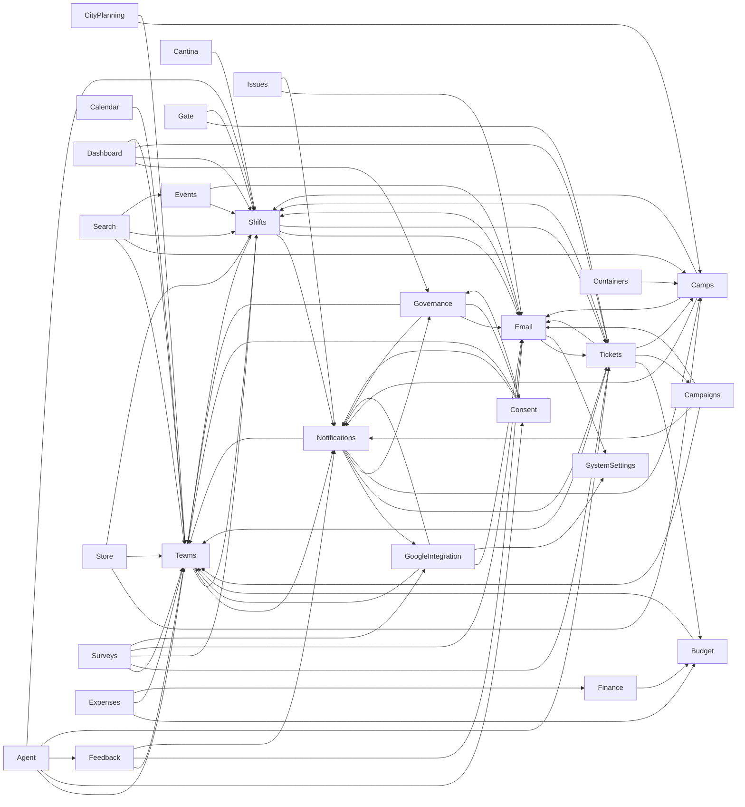

# Section Dependency DAG — G0 Audit

> Generated 2026-08-03 for the **G0** gate of
> [`2026-06-13-q3-transition-plan.md`](2026-06-13-q3-transition-plan.md), from Reforge
> semantic queries (`reforge injected`, `reforge dependencies`) against the solution at
> commit `5a9bbe198`. Section membership taken from `reforge.surface-score.json`.
> Cross-checked against the existing service-level graph in
> [`docs/architecture/dependency-graph.md`](../architecture/dependency-graph.md) (not
> edited by this doc).

## Method

1. Read `reforge.surface-score.json` for section membership (paths/symbols/interfaces).
2. `reforge injected <I...ServiceRead>` for all 15 read-split interfaces in the solution,
   and `reforge injected <I...Invalidator>` for all 18 invalidator interfaces, to find
   every cross-section constructor consumer.
3. `reforge dependencies <Class>` for the four sections that exist in code but are
   **missing from `reforge.surface-score.json`** (Gate, Surveys, SystemSettings,
   ICalFeed) so their edges aren't silently dropped.
4. Cross-checked against `docs/architecture/dependency-graph.md`'s existing service→service
   graph (which is Reforge/manually maintained and current through PR #1066) — every node
   in that graph was mapped to a `reforge.surface-score.json` section and collapsed to a
   section-level edge. Divergences between the two are called out below rather than
   silently reconciled.
5. Classified each edge as **read-interface** (`I<Section>ServiceRead`), **full-service**,
   **invalidator** (cache-invalidation port), or **orchestrator fan-out**.
6. Background jobs (`Infrastructure/Jobs/**`) and `AdminDatabaseDiagnosticsService` sit
   above the service layer like controllers (they fan out into many sections by design,
   same as Onboarding) — they are **not** drawn as section→section edges; noted separately
   where relevant.

## Section inventory gap (blocks the G0 "section inventory frozen" checklist item)

`reforge.surface-score.json` does not yet define **four sections that exist in the
codebase today**: `Gate` (#1066), `Surveys`, `SystemSettings`, `ICalFeed`. Files under
these fall through to Reforge's namespace-fallback grouping instead of a named section —
`surface-score` numbers for them are unreliable until they're added. **Recommend adding
all four to `reforge.surface-score.json` before G0 closes.**

Separately, the transition plan's own **Section tracker** (in
`2026-06-13-q3-transition-plan.md`) has drifted from `reforge.surface-score.json`:

| Plan tracker row | Reality in `reforge.surface-score.json` / code | Recommendation |
|---|---|---|
| `Profiles` (shared contract, separate row) | Folded entirely into `Users` — no distinct `Profiles` section exists. `ProfileService` is picture-only (#685); everything else moved to `User`/`Profile*` under `Users`. | Drop the separate `Profiles` row; the plan's own pillar 1 ("one identity") already assumes this merge happened. |
| `Onboarding` (vertical, orchestrator, separate row) | Folded entirely into `Users` (`Services/Onboarding/**` is a `Users` path). | See **Challenged edges** below — this conflation is actively hurting the shared-contract model. Recommend splitting `Onboarding` out as its own section in `reforge.surface-score.json`, matching the plan's own tracker intent. |
| `Mailer` (separate row) | Folded into `Email` (`Interfaces/Mailer/**`, `Services/Mailer/**` are `Email` paths). | Harmless rename; drop the separate row or rename `Email` row to `Email/Mailer`. |
| `Holded` (separate row) | This is the `Finance` section (`Finance*`, `Holded*`, `IHolded*`). | Rename tracker row `Holded` → `Finance`. |
| `LegalAndConsent` (separate row) | This is the `Consent` section (bundles `Legal*` + `Consent*`). | Rename tracker row → `Consent`. |
| `Guide`, `Debug`, `Scanner` (separate rows) | All three sit on `Platform` paths in `reforge.surface-score.json` (`GuideController`, `DebugController`, `ScannerController`). | ~~Demote these three rows; they ride with `Platform`.~~ **Withdrawn 2026-08-03** — the confirmed inventory ([`2026-08-03-proposed-frozen-section-inventory.md`](2026-08-03-proposed-frozen-section-inventory.md)) explicitly **keeps all three as sections**, rejects the demote-for-thinness suggestion, and dissolves `Platform` as a section bucket. The fix runs the other way: correct their paths in `reforge.surface-score.json` (config PR). Left standing, this present-tense demotion would drive later G0/G5 work to undo the frozen taxonomy and contradicts the `sections-are-logical-units` rule. |
| *(missing entirely)* | `Gate`, `Surveys`, `SystemSettings`, `ICalFeed`, `Dashboard`, `Admin`, `Platform`, `Search`, `Gdpr` all exist as real sections/services in code but have no tracker row. | **Corrected 2026-08-03:** add rows for `Gate`, `Surveys`, `SystemSettings`, `ICalFeed` before G0 closes. **`Admin` is explicitly excluded** — `docs/architecture/peters-hard-rules.md`/`CLAUDE.md` state `/Admin/*` is a nav holder, not a section, and the frozen-inventory proposal (`2026-08-03-proposed-frozen-section-inventory.md` §C) already classifies it that way. `Dashboard`, `Search`, `Gdpr`, `Platform` are an open classification question in that same proposal (orchestrator/crosscut/Platform-infrastructure candidates, not flatly "add a row") — don't pre-empt it here. |

## Vertical-section DAG

Excludes the shared-contract exceptions (`Users`, `Auth`, `AuditLog`) and the horizontal
`Platform` bucket — see the **Shared-contract dependencies** table below for those. **77**
distinct consumer→provider section pairs (71 originally + 6 found 2026-08-03: Agent→Teams,
Agent→Consent, Agent→Feedback, Agent→Tickets, Agent→Shifts, Email→SystemSettings) across
26 vertical sections (25 + `Agent`, which was omitted from the original edge-collection
pass entirely despite already being a real `reforge.surface-score.json` section).

**Cycles (7 total) — see "Cycles" section below for the full breakdown; the reciprocal
pairs visible above are `Governance↔Consent`, `Teams↔Shifts`, `Tickets↔Shifts`, plus four
more that only show up once `Notifications` is expanded past its `NotifEmitter`/
`NotificationMeterProvider` split (not visible as a single arrow pair above because the
write and read sides are different classes — see below).**

## Edge table

| Consumer | Provider | Mechanism | Symbols | Notes |
|---|---|---|---|---|
| Teams | Shifts | full-service | `IShiftManagementService` (`TeamService`, `TeamPageService`) + `IShiftAuthorizationInvalidator`, `IEarlyEntryInvalidator` | Cycle partner (Shifts lazy-resolves Team back) |
| Teams | Notifications | full-service + invalidator | `INotificationEmitter`, `INotificationMeterCacheInvalidator` (`TeamService`) | Cycle partner (NotifMeter reads Team back) |
| Camps | Notifications | full-service | `INotificationEmitter` (`CampService`, `CampContactService`, `CampRoleService`) | Cycle partner (NotifMeter reads Camp back) |
| Camps | Email | full-service | `IEmailService` (`CampContactService`) | |
| Camps | Shifts | invalidator | `IEarlyEntryInvalidator` (`CampService`) | |
| Cantina | Shifts | full-service | `IShiftManagementService` (`CantinaRosterService`) | |
| CityPlanning | Camps | read-interface | `ICampServiceRead` | |
| CityPlanning | Teams | read-interface | `ITeamServiceRead` | |
| Shifts | Notifications | full-service | `INotificationEmitter` (`ShiftSignupService`) | |
| Shifts | Teams | read-interface (lazy) | `ITeamServiceRead` (`ShiftManagementService`) | Cycle partner (see Teams→Shifts) |
| Shifts | Email | full-service | `IEmailService` (`RotaCoordinatorMessageService`) | |
| Governance | Email | full-service | `IEmailService` (`ApplicationDecisionService`) | |
| Governance | Notifications | full-service + invalidator | `INotificationEmitter`, `INotificationMeterCacheInvalidator` (`ApplicationDecisionService`) | Cycle partner (NotifMeter reads AppDec back) |
| Governance | Consent | full-service (lazy) | `IConsentServiceRead`/`ILegalDocumentSyncService` (`MembershipCalculator`, `GovernanceIndexService`) | **Real DI cycle** — both lazy |
| Consent | Governance | full-service (lazy) | `IMembershipCalculator` (`ConsentService`) | **Real DI cycle** — both lazy |
| Governance | Teams | read-interface | `ITeamServiceRead` (`MembershipQuery`) | |
| Consent | Teams | full-service | `ITeamService` (`AdminLegalDocumentService`, `LegalDocumentSyncService`) | |
| Consent | Notifications | full-service | `INotificationEmitter`/`INotificationInboxService` (`LegalDocumentSyncService`, `ConsentService`) | |
| Tickets | Budget | full-service | `IBudgetService` (`TicketQueryService`, `TicketingBudgetService`) | |
| Tickets | Campaigns | read + full (write) | `ICampaignServiceRead` (`TicketQueryService`); full `ICampaignService` (`TicketSyncService`, sole call is the write `MarkGrantsRedeemedAsync`) | Consistent — write legitimately needs the full interface (challenge withdrawn 2026-08-03) |
| Tickets | Teams | read-interface | `ITeamServiceRead` (`TicketQueryService`, `OnsiteRosterService`) | |
| Tickets | Shifts | full-service | `IShiftManagementService` (`TicketQueryService`, `TicketSyncService`, `AttendeeContactImportService`) | **Real DI cycle** partner (Shifts lazy-resolves `ITicketServiceRead`) |
| Shifts | Tickets | read-interface (lazy) | `ITicketServiceRead` (`ShiftManagementService`) | **Real DI cycle** |
| Tickets | Email | full-service | `IEmailService` (`TicketTransferService`) | |
| Tickets | Camps | read-interface | `ICampServiceRead` (`OnsiteRosterService`) | |
| Campaigns | Teams | full-service | `ITeamService` (`CampaignService`) | |
| Campaigns | Notifications | full-service | `INotificationEmitter` (`CampaignService`) | |
| Campaigns | Email | full-service | `IEmailService` (`CampaignService`) | |
| GoogleIntegration | Teams | full-service | `ITeamService`/`ITeamResourceService` (multiple) | |
| GoogleIntegration | Email | full-service | `IEmailService` (`EmailProvisioningService`, `GoogleRemovalNotificationService`) | |
| GoogleIntegration | Notifications | full-service | `INotificationEmitter` (`EmailProvisioningService`) | Cycle partner (NotifMeter reads GSyncSvc back) |
| GoogleIntegration | SystemSettings | full-service | `ISystemSettingsService` (`DriveActivityMonitorService`) | Missing-from-inventory section (see above) |
| Feedback | Teams | full-service | `ITeamService` | |
| Feedback | Email | full-service | `IEmailService` | |
| Feedback | Notifications | full-service | `INotificationEmitter` | |
| Budget | Teams | full-service | `ITeamService` | |
| Finance | Budget | full-service | `IBudgetService` (`HoldedFinanceService`) | |
| Calendar | Teams | full-service | `ITeamService` | |
| Dashboard | Governance | full-service | `IMembershipCalculator`, `IApplicationServiceRead` (mixed) | |
| Dashboard | Shifts | full-service | `IShiftManagementService`, `IShiftView` | |
| Dashboard | Tickets | read-interface | `ITicketServiceRead` | |
| Dashboard | Teams | full-service | `ITeamService` | |
| Notifications | GoogleIntegration | read-interface | `IGoogleSyncServiceRead` (`NotificationMeterProvider`) | Cycle partner |
| Notifications | Teams | read-interface | `ITeamServiceRead` (`NotificationMeterProvider`) | Cycle partner |
| Notifications | Tickets | full-service | `ITicketSyncService` (`NotificationMeterProvider`) | **Challenged** — read-interface exists on Tickets but not used here |
| Notifications | Governance | read-interface | `IApplicationServiceRead` (`NotificationMeterProvider`) | Cycle partner |
| Notifications | Camps | read-interface | `ICampServiceRead` (`NotificationMeterProvider`) | Cycle partner |
| Search | Teams | read-interface | `ITeamServiceRead` | |
| Search | Camps | read-interface | `ICampServiceRead` | |
| Search | Shifts | full-service | `IShiftManagementService` | |
| Search | Events | read-interface | `IEventServiceRead` | |
| Issues | Email | full-service | `IEmailService` | |
| Issues | Notifications | full-service | `INotificationEmitter`, `INotificationInboxService` | |
| Store | Camps | read-interface | `ICampServiceRead` | |
| Store | Teams | read-interface | `ITeamServiceRead` | |
| Store | Shifts | full-service | `IShiftManagementService` | |
| Surveys | Teams | read-interface | `ITeamServiceRead` | Missing-from-inventory section |
| Surveys | Tickets | read-interface | `ITicketServiceRead` | Missing-from-inventory section |
| Surveys | Shifts | read-interface | `IShiftView` (`SurveyService`) | Missing-from-inventory section — **corrected 2026-08-03**: `IShiftView` is read-only (see Email→Shifts row for the same interface); was mislabeled full-service |
| Surveys | Email | full-service | `IEmailService` | Missing-from-inventory section |
| Surveys | GoogleIntegration | full-service | `IGoogleTranslationService` | Missing-from-inventory section |
| Gate | Tickets | read-interface | `ITicketServiceRead` | Missing-from-inventory section |
| Gate | Shifts | full-service | `IEarlyEntryService`, `IBurnSettingsService`, `IShiftManagementService` | Missing-from-inventory section; Shifts has no read-split boundary at all yet |
| Expenses | Budget | full-service | `IBudgetService` | |
| Expenses | Teams | full-service | `ITeamService` | |
| Expenses | Finance | full-service | `IHoldedFinanceService` | |
| Containers | Camps | read-interface | `ICampServiceRead` | |
| Email | Shifts | read-interface | `IShiftView` (Mailer audience classes, fanned via `IEnumerable<IMailerAudience>`) | Not drawn in `dependency-graph.md`'s diagram (per-audience deps excluded there as noise) |
| Email | Tickets | read-interface | `ITicketServiceRead` (Mailer audience classes) | Same as above |
| Events | Shifts | full-service | `IBurnSettingsService` | |
| Events | Email | full-service | `IEmailService` | |
| Agent | Teams | read-interface | `ITeamServiceRead` (`AgentUserSnapshotProvider`) | **Added 2026-08-03** — Agent section omitted from the original edge-collection pass entirely (it's not a missing-from-inventory section; it's already in `reforge.surface-score.json`) |
| Agent | Consent | read-interface | `IConsentServiceRead` (`AgentUserSnapshotProvider`) | **Added 2026-08-03** |
| Agent | Feedback | full-service | `IFeedbackService` (`AgentUserSnapshotProvider`) | **Added 2026-08-03** — see Feedback audit correction, this is Feedback's only cross-section consumer |
| Agent | Tickets | read-interface | `ITicketServiceRead` (`AgentUserSnapshotProvider`) | **Added 2026-08-03** |
| Agent | Shifts | mixed read + full | `IShiftView` (read) + `IShiftManagementService` (full) (`AgentUserSnapshotProvider`) | **Added 2026-08-03** |
| Email | SystemSettings | full-service | `ISystemSettingsService` (`EmailOutboxService`) | **Added 2026-08-03** — omitted from the original edge-collection pass; missing-from-inventory section (see above) |

**Orphaned read-interfaces — corrected 2026-08-03:** the original "zero injectors
solution-wide" list was `reforge injected`-only, which misses Web-layer
primary-constructor consumers, authorization handlers, and
`IServiceProvider.GetService<T>()`-style resolution. Five of the original six are **not**
orphaned — verified via direct grep + exact-case file reads:

- `IVolunteerTrackingServiceRead` (Shifts) — `VolunteerBuildStripViewComponent`
  (`src/Humans.Web/ViewComponents/VolunteerBuildStripViewComponent.cs:9`), intra-section.
- `IExpenseReportServiceRead` (Expenses) — `IbanAccessHandler`
  (`src/Humans.Web/Authorization/Requirements/IbanAccessHandler.cs:17`) and
  `ExpensesController` (`:22`), intra-section.
- `IEmailOutboxServiceRead` (Email) — `ProfileController` (`:70`) and
  `UsersAdminController` (`:31`), **both Users-section Web controllers** — a live
  cross-contract edge (Users → Email) not currently drawn anywhere in this DAG;
  additional evidence for Challenged edge #1's "Users is not outbound-edge-free" finding.
- `ICalendarServiceRead` (Calendar) — `CalendarController.cs:26`, intra-section.
- `ILegalDocumentCacheInvalidator` (Consent) — resolved via
  `services.GetService<ILegalDocumentCacheInvalidator>()` in
  `LegalDocumentSaveChangesInterceptor.cs:75`, intra-section (service-locator, not
  constructor injection — invisible to `reforge injected`).

Only `IEventViewInvalidator` (Events) is left standing from the original six — not
reverified this pass, still a G1 dead-interface-sweep candidate. (`ICityPlanningServiceRead`
is separately confirmed to have zero *Application-layer* consumers but real Web-layer
ones — working as documented, not orphaned.)

## Shared-contract dependencies

Per the plan: `Users`/`UserInfo`, `Auth`, `AuditLog` are the blessed exceptions — "things
genuinely used everywhere" that may sit upstream as shared contracts. Kept out of the main
DAG. **Every vertical section below depends on `Users`** (mostly via `IUserServiceRead`);
listed once here rather than as 25+ separate diagram edges.

| Shared contract | Depended on by | Mechanism |
|---|---|---|
| `Users` (`IUserServiceRead`/`UserInfo`) | AuditLog, Auth, Budget, Campaigns, Camps, Cantina, CityPlanning, Consent, Dashboard, Events, Expenses (full `IUserService` — `ExpenseReportService`), Feedback (full `IUserService` — `FeedbackService`), GoogleIntegration, Governance, ICalFeed, Issues, Consent(Legal), Email(Mailer), Notifications, Search, Shifts, Surveys, Teams, Tickets, Platform, Agent, Gate (full `IUserService`, not the read cut) | Read-interface everywhere except Expenses, Feedback, Gate — **corrected 2026-08-03**: Expenses/Feedback were missing from this row entirely, both inject full `IUserService`, not the read cut |
| `Auth` (`IRoleAssignmentService`) | Agent (`AgentUserSnapshotProvider`), Camps (via Users' `ContactFieldService`... see Challenged), Gate, Issues, Onboarding(Users), Tickets(`OnsiteRosterService`), Users(`AccountDeletionService`,`AccountMergeService`,`DuplicateAccountService`), Notifications(`NotificationRecipientResolver`), background jobs | Mostly full-service + `IRoleAssignmentClaimsCacheInvalidator`/`IRoleAssignmentCacheInvalidator` |
| `AuditLog` (`IAuditLogService`) | Nearly every write-path service (36 dependents per `dependency-graph.md`'s fan-in table) — Teams, Camps, Tickets, GoogleIntegration, Feedback, Store, Containers, Expenses, Gate, Surveys, Users, etc. | Full-service, one-way (Audit has zero outbound edges to verticals except the AuditViewer exception below) |

**Proposed 4th exception — `Platform`:** not named in the plan's original three, but plays
the identical role. `HumansMetricsService` (4 dependents: Consent, HumanLifecycle/Users,
Governance, OutboxEmail/Notifications), `INavBadgeCacheInvalidator` (4 dependents: Auth,
Feedback, Governance, Issues), `AdminDatabaseDiagnosticsService` (reads Users + Tickets for
diagnostics), `GuideRoleResolver` (reads Teams). Recommend G0 formally adds `Platform` to
the shared-contract exception list so these don't get flagged as violations later.

## Challenged edges

These are exactly what G0 is supposed to surface for the plan to explicitly bless or
schedule a fix.

1. **The `Users` section is not outbound-edge-free, because it silently contains
   `Onboarding`.** The true identity core (`UserService`/`IUserServiceRead`/`UserInfo`) has
   zero outbound edges — that's real and matches the "shared contract" model. But
   `reforge.surface-score.json` also folds `OnboardingService`, `OnboardingWidgetState`,
   `HumanLifecycleService`, `AccountDeletionService`, `AccountMergeService`,
   `DuplicateAccountService`, and `UserParticipationBackfillService` into the same `Users`
   section. Those classes are legitimate **orchestrators** (the hard rules explicitly allow
   orchestrators to fan out) — but because they're bucketed with the identity core, the
   *section* `Users` shows outbound edges into Governance, Consent, Email, Notifications,
   Shifts, Tickets, and (via `ContactFieldService`) Teams. If `Users` becomes its own G5
   assembly while still containing these orchestrators, it cannot compile — every one of
   those verticals also depends back on `Users` for `IUserServiceRead`, so the shared
   contract would need to reference the verticals that reference it. **Recommend: split
   `Onboarding` out as its own section in `reforge.surface-score.json`** (matching what the
   plan's own tracker already calls it — "vertical (orchestrator)", not shared contract),
   and move `AccountDeletionService`/`AccountMergeService`/`DuplicateAccountService`/
   `UserParticipationBackfillService` there or to a similar orchestrator carve-out. Leaves
   the real `Users` shared contract clean.
2. **`AuditLog` (horizontal) reaches into `Teams` (vertical).** `AuditViewerService` eagerly
   injects `ITeamService`/`ITeamResourceService` for display-name stitching on audit pages.
   Peter's hard rules: horizontals are "strictly forbidden from referencing vertical
   sections beyond their current state." This is a deliberate, documented design (moved out
   of `AuditLogRepository` in a 2026-05 alignment pass), but it's still a horizontal
   depending on a vertical — needs an explicit call from Peter on whether this is a
   permanent exception (like Users/Auth) or scheduled for the #799 event-bus treatment.
3. **`Tickets → Campaigns` — withdrawn on verification (2026-08-03).** Initially flagged as
   inconsistent split adoption, but `TicketSyncService`'s single `ICampaignService` call is
   `MarkGrantsRedeemedAsync` — a genuine cross-section **write**, legitimate through the full
   interface per the hard rules. `TicketQueryService`'s read correctly uses
   `ICampaignServiceRead`. No fix needed; edge row updated to `read + full (write)` intent.
4. **`Notifications → Tickets` bypasses the read-interface.** `NotificationMeterProvider`
   injects the full `ITicketSyncService` while every other cross-section Tickets consumer
   uses `ITicketServiceRead`. Either the read DTO needs a `GetFailedSyncEventCount`-style
   method added, or this is legitimately Sync-specific state that doesn't belong on
   `TicketOrderInfo` — needs a look, not an assumption.
5. **`Gate → Users` uses the full `IUserService`, not `IUserServiceRead`.** Every other
   cross-section consumer reads `IUserServiceRead`; Gate is the only one importing full
   write-capable `IUserService` for what looks like a lookup-only need. Worth a pass once
   Gate is added to the inventory.
6. **`GoogleIntegration` #500 entity-leak items (already flagged in `dependency-graph.md`'s
   own follow-up notes, not yet in a demolition-inventory item):** `AuditLogEntry.Resource`
   navigates directly into `GoogleResource` instead of going through
   `ITeamResourceService.GetResourceNamesByIdsAsync`; `GoogleResource.Team` is a live EF nav
   from GoogleIntegration's entity into Teams' entity (should be a typed FK, not a nav);
   `GoogleController`/`ProfileController` inject `IMemoryCache` directly instead of going
   through `IUserEmailService.InvalidateNobodiesTeamEmailsAsync()`. These are G1 "no entity
   leak across boundary" violations with a known owner and a known fix — they just haven't
   been through `/section-gate audit` yet.
7. **Orphaned read-interfaces and invalidators** — **rewritten 2026-08-03.** The original
   challenge listed `IVolunteerTrackingServiceRead`, `IExpenseReportServiceRead`,
   `IEmailOutboxServiceRead` and `ICalendarServiceRead` as having zero injectors solution-wide.
   That is stale: the corrected block under the edge table names concrete consumers for **every
   one of them** — including the cross-contract Users → Email edge, where `ProfileController`
   and `UsersAdminController` both inject `IEmailOutboxServiceRead`. Keeping them listed as
   deletion candidates would target live boundaries. Only `IEventViewInvalidator` (Events) is
   genuinely unconsumed — either dead surface (delete) or scaffolded ahead of a consumer that
   hasn't landed yet (keep, but track).

## Cycles — 7 found, all block G5 unless resolved first

**3 are real DI cycles today** (require `IServiceProvider`/`Lazy<T>` resolution to avoid a
constructor-injection deadlock):

1. **Teams ↔ Shifts** — `TeamService` eagerly injects `IShiftManagementService`;
   `ShiftManagementService` lazy-resolves `ITeamServiceRead`.
2. **Tickets ↔ Shifts** — `TicketQueryService`/`TicketSyncService` eagerly inject
   `IShiftManagementService`; `ShiftManagementService` lazy-resolves `ITicketServiceRead`.
3. **Governance ↔ Consent** — `MembershipCalculator` lazy-resolves `IConsentServiceRead`;
   `ConsentService` lazy-resolves `IMembershipCalculator`. Both sides lazy (the only "hot
   two-way" pair in the solution).

**4 more are section-level-only cycles** — invisible in today's DI graph because the write
side and the read side are *different classes* within the same section, so no single class
needs lazy resolution, but a G5 project split would still create a circular assembly
reference:

4. **Teams ↔ Notifications** — `TeamService` writes via `INotificationEmitter`;
   `NotificationMeterProvider` reads `ITeamServiceRead` back.
5. **Camps ↔ Notifications** — `CampService`/`CampContactService`/`CampRoleService` write
   via `INotificationEmitter`; `NotificationMeterProvider` reads `ICampServiceRead` back.
6. **Governance ↔ Notifications** — `ApplicationDecisionService` writes via
   `INotificationEmitter`; `NotificationMeterProvider` reads `IApplicationServiceRead` back.
7. **GoogleIntegration ↔ Notifications** — `EmailProvisioningService` writes via
   `INotificationEmitter`; `NotificationMeterProvider` reads `IGoogleSyncServiceRead` back.

Cycles 4–7 share one root cause: `NotificationMeterProvider` (badge-count reads) sits in
the same section as `NotificationEmitter` (enqueue writes), and four sections both write to
one and get read by the other. **This is exactly what #580/#581's push-model inversion
already targets** — `dependency-graph.md`'s own follow-up notes say landing #581 leaves
`NotificationMeterProvider` "pure registry infrastructure with zero outgoing edges," which
resolves all four of these in one PR. Cycles 1–3 don't have an equivalent single fix in
flight; they'd need either the #799 event bus or a deliberate one-side restructure. They
are **not** shared-contract-exception candidates (none of the four sections involved is
User/Auth/AuditLog/Platform) — they need an actual architectural resolution before their
sections can enter G5.

## Divergences from `docs/architecture/dependency-graph.md`

- That doc is the primary source for this audit's full-service/lazy edge data and is
  current and well-maintained (through PR #1066) — no meaningful drift found in its
  service-level edges themselves.
- It groups by ad-hoc `classDef` colors (e.g., separate `profiles`/`users` colors) that
  don't match a single `reforge.surface-score.json` section — this DAG collapses `profiles`
  into `Users` per the JSON config, which is the more accurate current-state view (see the
  inventory-gap table above).
- It omits the Mailer per-audience `IShiftView`/`ITicketServiceRead` edges "as noise" —
  this DAG includes them (`Email → Shifts`, `Email → Tickets`) since G0 needs the complete
  picture even where the class-level graph reasonably simplifies for readability.
- It doesn't classify edges as read-interface vs. full-service at the table level (only in
  prose footnotes) — this DAG makes that classification the primary axis, which is what
  surfaced findings #3–#5 in Challenged edges.
- It has no equivalent of the "section-level-only cycle" concept (cycles 4–7 above) because
  it's organized at class granularity, where those aren't cycles at all — this is a
  by-product of moving to section granularity for the G5 gate, not an error in that doc.

## Summary

**77** vertical-to-vertical section edges (corrected 2026-08-03, was 71 — see the
Vertical-section DAG intro for the 6 added edges) across **26** vertical sections (25 +
`Agent`, added 2026-08-03; plus the four missing-from-inventory sections once added), plus
the `Users`/`Auth`/`AuditLog`
(+proposed `Platform`) shared-contract fan-in depended on by nearly every section. **7
section-level cycles found** (3 real DI cycles: Teams↔Shifts, Tickets↔Shifts,
Governance↔Consent; 4 Notifications-pattern cycles: Teams/Camps/Governance/GoogleIntegration
↔ Notifications, all resolvable by landing #581). **7 challenged items** requiring an
explicit decision or scheduled fix, headlined by the `Users`/`Onboarding` conflation
undermining the shared-contract model, and a horizontal (`AuditLog`) reaching into a
vertical (`Teams`). Section inventory itself needs updating before G0 can close: four real
sections (`Gate`, `Surveys`, `SystemSettings`, `ICalFeed`) are missing from
`reforge.surface-score.json` entirely, and the transition plan's own tracker table has six
rows that don't match current section reality (stale `Profiles`/`Onboarding` split,
`Mailer`/`Holded`/`LegalAndConsent` renames, and `Guide`/`Debug`/`Scanner` that should ride
with `Platform` instead of getting their own G1–G5 ladder).
