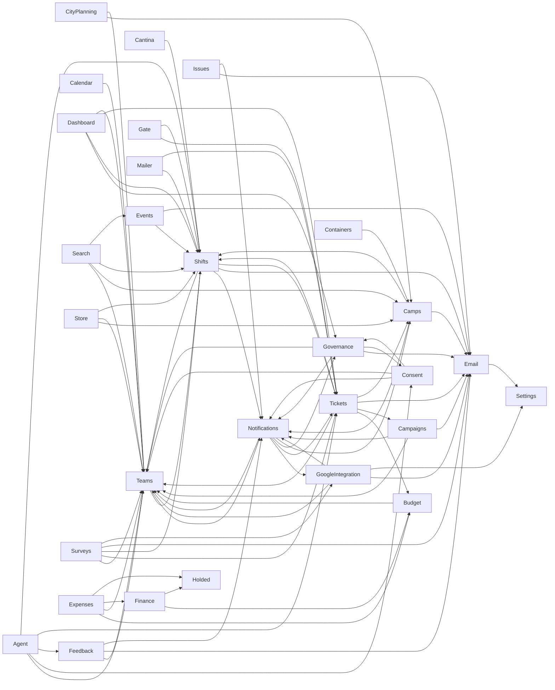

# Section Dependency DAG — G0 Audit

> Generated 2026-08-03 for the **G0** gate of
> [`2026-06-13-q3-transition-plan.md`](2026-06-13-q3-transition-plan.md), from Reforge
> semantic queries (`reforge injected`, `reforge dependencies`) against the solution at
> commit `5a9bbe198`. Section membership taken from `reforge.surface-score.json`.
> Cross-checked against the existing service-level graph in
> [`docs/architecture/dependency-graph.md`](../architecture/dependency-graph.md) (not
> edited by this doc).

## Method

1. Read `reforge.surface-score.json` for section membership (paths/symbols/interfaces).
2. `reforge injected <I...ServiceRead>` for all 15 read-split interfaces in the solution,
   and `reforge injected <I...Invalidator>` for all 18 invalidator interfaces, to find
   every cross-section constructor consumer.
3. `reforge dependencies <Class>` for the four sections that exist in code but are
   **missing from `reforge.surface-score.json`** (Gate, Surveys, SystemSettings,
   ICalFeed) so their edges aren't silently dropped.
4. Cross-checked against `docs/architecture/dependency-graph.md`'s existing service→service
   graph (which is Reforge/manually maintained and current through PR #1066) — every node
   in that graph was mapped to a `reforge.surface-score.json` section and collapsed to a
   section-level edge. Divergences between the two are called out below rather than
   silently reconciled.
5. Classified each edge as **read-interface** (`I<Section>ServiceRead`), **full-service**,
   **invalidator** (cache-invalidation port), or **orchestrator fan-out**.
6. Background jobs (`Infrastructure/Jobs/**`) and `AdminDatabaseDiagnosticsService` sit
   above the service layer like controllers (they fan out into many sections by design,
   same as Onboarding) — they are **not** drawn as section→section edges; noted separately
   where relevant.

**Scope consequence, stated explicitly 2026-08-03 (previously implicit, which made this
document look incomplete rather than scoped).** Step 6 makes the edge table and diagram a
**service-layer** graph. What follows from that, and what readers have to know:

- A section whose only cross-section calls come from a Web controller gets **no node**.
  `Scanner` is the clearest case — it has no `Services/Scanner/**` at all, so despite
  `ScannerController` calling Tickets, Gate, Consent, Calendar, Events and Shifts contracts,
  it is correctly absent from the graph under this scope. Absent ≠ dependency-free.
- The **`Users` shared-contract fan-in table deliberately uses the opposite scope** and
  *does* count Web-controller consumers, because its job is "what would need a project
  reference to `Users`", which controllers plainly would. The two tables answer different
  questions; the mismatch is intentional, not drift.
- **Open question for G4/G5, not resolved here:** if sections take their controllers with
  them at the assembly split, then controller→service calls *are* section→section project
  references and this graph is missing a whole layer of them. If controllers stay in a shared
  `Humans.Web`, the current scope is right. That decision has to land before this DAG can be
  used to plan project references — flagging rather than guessing.

## Section inventory gap (config follow-up; the inventory itself is frozen)

**Rewritten 2026-08-03** — the original text called `Gate`, `Surveys`, `SystemSettings` and
`ICalFeed` four standalone sections and recommended adding all four to
`reforge.surface-score.json` before G0 closes. Two of those names did not survive the freeze,
so following that recommendation would undo the canonical taxonomy.

`reforge.surface-score.json` still lags the frozen inventory
([`2026-08-03-proposed-frozen-section-inventory.md`](2026-08-03-proposed-frozen-section-inventory.md)).
Files that fall through to Reforge's namespace-fallback grouping have unreliable
`surface-score` numbers, so the config needs these edits — **as a config follow-up, not a G0
blocker; the section inventory is already frozen**:

- Add `Gate` (#1066), `Settings` (ex-`SystemSettings`, absorbs #864), `Development`, `Gdpr`
  and `Search` as named sections.
- Map `ICalFeed` paths into **Calendar** — it is not a standalone section.
- Rename `Survey` → `Surveys`.
- Map `Interfaces/Mailer/**` + `Services/Mailer/**` to `Mailer` (not `Email`), and split the
  `Holded*` paths out of `Finance` — both are vendor connectors with their own rows.
- Correct the `Guide`, `Debug` and `Scanner` paths off the dissolved `Platform` bucket.

Separately, the transition plan's own **Section tracker** (in
`2026-06-13-q3-transition-plan.md`) has drifted from `reforge.surface-score.json`:

| Plan tracker row | Reality in `reforge.surface-score.json` / code | Recommendation |
|---|---|---|
| `Profiles` (shared contract, separate row) | Folded entirely into `Users` — no distinct `Profiles` section exists. `ProfileService` is picture-only (#685); everything else moved to `User`/`Profile*` under `Users`. | Drop the separate `Profiles` row; the plan's own pillar 1 ("one identity") already assumes this merge happened. |
| `Onboarding` (vertical, orchestrator, separate row) | Folded entirely into `Users` (`Services/Onboarding/**` is a `Users` path). | See **Challenged edges** below — this conflation is actively hurting the shared-contract model. Recommend splitting `Onboarding` out as its own section in `reforge.surface-score.json`, matching the plan's own tracker intent. |
| `Mailer` (separate row) | Folded into `Email` (`Interfaces/Mailer/**`, `Services/Mailer/**` are `Email` paths) in `reforge.surface-score.json`. | ~~Drop the separate row or rename `Email` → `Email/Mailer`.~~ **Withdrawn 2026-08-03** — the confirmed inventory keeps `Mailer` as its own **vendor connector** row, and the `vendor connectors stay separate replaceable sections` rule is the reason. Keep the tracker row; fix the *config* so `Interfaces/Mailer/**` and `Services/Mailer/**` map to `Mailer`, not `Email`. |
| `Holded` (separate row) | Bundled with `Finance` (`Finance*`, `Holded*`, `IHolded*`) in `reforge.surface-score.json`. | ~~Rename tracker row `Holded` → `Finance`.~~ **Withdrawn 2026-08-03** — same rule: `Holded` is a vendor connector and stays its own row alongside `Finance`. Split the config paths rather than merging the rows. |
| `LegalAndConsent` (separate row) | This is the `Consent` section (bundles `Legal*` + `Consent*`). | Rename tracker row → `Consent`. |
| `Guide`, `Debug`, `Scanner` (separate rows) | All three sit on `Platform` paths in `reforge.surface-score.json` (`GuideController`, `DebugController`, `ScannerController`). | ~~Demote these three rows; they ride with `Platform`.~~ **Withdrawn 2026-08-03** — the confirmed inventory ([`2026-08-03-proposed-frozen-section-inventory.md`](2026-08-03-proposed-frozen-section-inventory.md)) explicitly **keeps all three as sections**, rejects the demote-for-thinness suggestion, and dissolves `Platform` as a section bucket. The fix runs the other way: correct their paths in `reforge.surface-score.json` (config PR). Left standing, this present-tense demotion would drive later G0/G5 work to undo the frozen taxonomy and contradicts the `sections-are-logical-units` rule. |
| *(missing entirely)* | `Gate`, `Surveys`, `SystemSettings`, `ICalFeed`, `Dashboard`, `Admin`, `Platform`, `Search`, `Gdpr` all exist as real sections/services in code but have no tracker row. | **Superseded 2026-08-03 by the confirmed inventory** ([`2026-08-03-proposed-frozen-section-inventory.md`](2026-08-03-proposed-frozen-section-inventory.md)) — the open questions this row listed are now decided, so use the decision record, not this row: add rows for **`Gate`, `Settings`** (ex-`SystemSettings`, absorbs #864), **`Development`** (new; dev-only, takes DevLogin/DevSeed), **`Gdpr`** and **`Search`**; fold **`ICalFeed` into Calendar**; rename **`Survey` → `Surveys`**; **`Admin`, `Dashboard` and `Platform` are not sections** (`Platform` dissolves as a bucket). Back-propagating the original text would undo several frozen decisions. |

## Vertical-section DAG

Excludes the shared-contract exceptions (`Users`, `Auth`, `AuditLog`) and the horizontal
`Platform` bucket — see the **Shared-contract dependencies** table below for those.

**Dashboard is not a section (corrected 2026-08-03).** The frozen inventory classifies it as a
non-section GUI holder, so its four outgoing edges (`Dashboard → Governance/Shifts/Tickets/Teams`,
rows retained below for traceability) are **not** section→section dependencies — they originate in
shared web-shell code. They are excluded from the counts here and must not be used to plan a
`Dashboard` project boundary at G5; treating them as one would invent a boundary that doesn't exist
and hide that the dependencies live in the web shell. The `DB[Dashboard]` node and its four arrows
are likewise retained in the diagram below for traceability only.

On that basis the edge table below is the graph; the pairs it lists are the pairs, and the
diagram mirrors them. Edges found during the 2026-08-03 pass and not in the original collection:
Agent→Teams, Agent→Consent, Agent→Feedback, Agent→Tickets, Agent→Shifts, Email→Settings,
**Expenses→Holded**, **Finance→Holded**. Nodes added the same pass: `Agent`, `Holded`, `Mailer`.

Three collection errors account for the growth. The original pass omitted `Agent` despite it
already being a real `reforge.surface-score.json` section. It also read the vendor connectors
through that same config, which bundles `Holded*` under `Finance` and `Mailer*` under `Email`
— the freeze keeps both as separate vendor-connector rows, so `Holded` gains a node plus its
two inbound `IHoldedClient` edges (**+2 pairs**), and `Mailer` gains a node that takes over the
two audience edges previously attributed to `Email` (**a relabel, +1 node, +0 pairs** — `Email`
keeps its own `Email→Settings` edge and stays in the graph). Re-owning the Mailer edges
does not disturb the cycle analysis below: no listed cycle runs through `Email→Shifts` or
`Email→Tickets`.

**Cycles — see "Cycles" section below for the full breakdown; the reciprocal
pairs visible above are `Governance↔Consent`, `Teams↔Shifts`, `Tickets↔Shifts`, plus four
more that only show up once `Notifications` is expanded past its `NotifEmitter`/
`NotificationMeterProvider` split (not visible as a single arrow pair above because the
write and read sides are different classes — see below).**

## Edge table

| Consumer | Provider | Mechanism | Symbols | Notes |
|---|---|---|---|---|
| Teams | Shifts | full-service | `IShiftManagementService` (`TeamService`, `TeamPageService`) + `IShiftAuthorizationInvalidator`, `IEarlyEntryInvalidator` | Cycle partner (Shifts lazy-resolves Team back) |
| Teams | Notifications | full-service + invalidator | `INotificationEmitter`, `INotificationMeterCacheInvalidator` (`TeamService`) | Cycle partner (NotifMeter reads Team back) |
| Camps | Notifications | full-service | `INotificationEmitter` (`CampService`, `CampContactService`, `CampRoleService`) | Cycle partner (NotifMeter reads Camp back) |
| Camps | Email | full-service | `IEmailService` (`CampContactService`) | |
| Camps | Shifts | invalidator | `IEarlyEntryInvalidator` (`CampService`) | |
| Cantina | Shifts | full-service | `IShiftManagementService` (`CantinaRosterService`) | |
| CityPlanning | Camps | read-interface | `ICampServiceRead` | |
| CityPlanning | Teams | read-interface | `ITeamServiceRead` | |
| Shifts | Notifications | full-service | `INotificationEmitter` (`ShiftSignupService`) | |
| Shifts | Teams | read-interface (lazy) | `ITeamServiceRead` (`ShiftManagementService`) | Cycle partner (see Teams→Shifts) |
| Shifts | Email | full-service | `IEmailService` (`RotaCoordinatorMessageService`) | |
| Governance | Email | full-service | `IEmailService` (`ApplicationDecisionService`) | |
| Governance | Notifications | full-service + invalidator | `INotificationEmitter`, `INotificationMeterCacheInvalidator` (`ApplicationDecisionService`) | Cycle partner (NotifMeter reads AppDec back) |
| Governance | Consent | full-service (lazy) | `IConsentServiceRead`/`ILegalDocumentSyncService` (`MembershipCalculator`, `GovernanceIndexService`) | **Real DI cycle** — both lazy |
| Consent | Governance | full-service (lazy) | `IMembershipCalculator` (`ConsentService`) | **Real DI cycle** — both lazy |
| Governance | Teams | read-interface | `ITeamServiceRead` (`MembershipQuery`) | |
| Consent | Teams | full-service | `ITeamService` (`AdminLegalDocumentService`, `LegalDocumentSyncService`) | |
| Consent | Notifications | full-service | `INotificationEmitter`/`INotificationInboxService` (`LegalDocumentSyncService`, `ConsentService`) | |
| Tickets | Budget | full-service | `IBudgetService` (`TicketQueryService`, `TicketingBudgetService`) | |
| Tickets | Campaigns | read + full (write) | `ICampaignServiceRead` (`TicketQueryService`); full `ICampaignService` (`TicketSyncService`, sole call is the write `MarkGrantsRedeemedAsync`) | Consistent — write legitimately needs the full interface (challenge withdrawn 2026-08-03) |
| Tickets | Teams | read-interface | `ITeamServiceRead` (`TicketQueryService`, `OnsiteRosterService`) | |
| Tickets | Shifts | full-service | `IShiftManagementService` (`TicketQueryService`, `TicketSyncService`, `AttendeeContactImportService`) | **Real DI cycle** partner (Shifts lazy-resolves `ITicketServiceRead`) |
| Shifts | Tickets | read-interface (lazy) | `ITicketServiceRead` (`ShiftManagementService`) | **Real DI cycle** |
| Tickets | Email | full-service | `IEmailService` (`TicketTransferService`) | |
| Tickets | Camps | read-interface | `ICampServiceRead` (`OnsiteRosterService`) | |
| Campaigns | Teams | full-service | `ITeamService` (`CampaignService`) | |
| Campaigns | Notifications | full-service | `INotificationEmitter` (`CampaignService`) | |
| Campaigns | Email | full-service | `IEmailService` (`CampaignService`) | |
| GoogleIntegration | Teams | full-service | `ITeamService`/`ITeamResourceService` (multiple) | |
| GoogleIntegration | Email | full-service | `IEmailService` (`EmailProvisioningService`, `GoogleRemovalNotificationService`) | |
| GoogleIntegration | Notifications | full-service | `INotificationEmitter` (`EmailProvisioningService`) | Cycle partner (NotifMeter reads GSyncSvc back) |
| GoogleIntegration | Settings | full-service | `ISystemSettingsService` (`DriveActivityMonitorService`) | Provider renamed to the frozen name `Settings` 2026-08-03 (ex-`SystemSettings`); still absent from `reforge.surface-score.json` (config follow-up) |
| Feedback | Teams | full-service | `ITeamService` | |
| Feedback | Email | full-service | `IEmailService` | |
| Feedback | Notifications | full-service | `INotificationEmitter` | |
| Budget | Teams | full-service | `ITeamService` | |
| Finance | Budget | full-service | `IBudgetService` (`HoldedFinanceService`) | |
| Calendar | Teams | full-service | `ITeamService` | |
| Dashboard | Governance | full-service | `IMembershipCalculator`, `IApplicationServiceRead` (mixed) | |
| Dashboard | Shifts | full-service | `IShiftManagementService`, `IShiftView` | |
| Dashboard | Tickets | read-interface | `ITicketServiceRead` | |
| Dashboard | Teams | full-service | `ITeamService` | |
| Notifications | GoogleIntegration | read-interface | `IGoogleSyncServiceRead` (`NotificationMeterProvider`) | Cycle partner |
| Notifications | Teams | read-interface | `ITeamServiceRead` (`NotificationMeterProvider`) | Cycle partner |
| Notifications | Tickets | full-service | `ITicketSyncService` (`NotificationMeterProvider`) | **Challenged** — read-interface exists on Tickets but not used here |
| Notifications | Governance | read-interface | `IApplicationServiceRead` (`NotificationMeterProvider`) | Cycle partner |
| Notifications | Camps | read-interface | `ICampServiceRead` (`NotificationMeterProvider`) | Cycle partner |
| Search | Teams | read-interface | `ITeamServiceRead` | |
| Search | Camps | read-interface | `ICampServiceRead` | |
| Search | Shifts | full-service | `IShiftManagementService` | |
| Search | Events | read-interface | `IEventServiceRead` | |
| Issues | Email | full-service | `IEmailService` | |
| Issues | Notifications | full-service | `INotificationEmitter`, `INotificationInboxService` | |
| Store | Camps | read-interface | `ICampServiceRead` | |
| Store | Teams | read-interface | `ITeamServiceRead` | |
| Store | Shifts | full-service | `IShiftManagementService` | |
| Surveys | Teams | read-interface | `ITeamServiceRead` | Missing-from-inventory section |
| Surveys | Tickets | read-interface | `ITicketServiceRead` | Missing-from-inventory section |
| Surveys | Shifts | read-interface | `IShiftView` (`SurveyService`) | Missing-from-inventory section — **corrected 2026-08-03**: `IShiftView` is read-only (see Email→Shifts row for the same interface); was mislabeled full-service |
| Surveys | Email | full-service | `IEmailService` | Missing-from-inventory section |
| Surveys | GoogleIntegration | full-service | `IGoogleTranslationService` | Missing-from-inventory section |
| Gate | Tickets | read-interface | `ITicketServiceRead` | Missing-from-inventory section |
| Gate | Shifts | full-service | `IEarlyEntryService`, `IBurnSettingsService`, `IShiftManagementService` | Missing-from-inventory section; Shifts has no read-split boundary at all yet |
| Expenses | Budget | full-service | `IBudgetService` | |
| Expenses | Teams | full-service | `ITeamService` | |
| Expenses | Finance | full-service | `IHoldedFinanceService` | |
| Expenses | Holded | full-service | `IHoldedClient` (`ExpenseReportService.cs:36`) | **Added 2026-08-03** — omitted because the original pass read `Holded*` as part of `Finance` per `reforge.surface-score.json`; `Holded` is its own vendor-connector row, so this is a distinct edge alongside the `IHoldedFinanceService` one above |
| Finance | Holded | full-service | `IHoldedClient` (`HoldedFinanceService.cs:20`) | **Added 2026-08-03** — same cause; `Finance` reaching the vendor client directly is the connector edge the `Holded` row exists to carry |
| Containers | Camps | read-interface | `ICampServiceRead` | |
| Mailer | Shifts | read-interface | `IShiftView` (Mailer audience classes, fanned via `IEnumerable<IMailerAudience>`) | **Owner corrected 2026-08-03** — was attributed to `Email`. The freeze keeps `Mailer` a separate vendor-connector section (and this document's own §"keep `Mailer` and `Holded` as vendor-connector rows" says so); only `reforge.surface-score.json` still bundles the `Mailer*` paths under `Email`, which is the config back-propagation follow-up, not an ownership fact. Not drawn in `dependency-graph.md`'s diagram (per-audience deps excluded there as noise) |
| Mailer | Tickets | read-interface | `ITicketServiceRead` (Mailer audience classes) | Same as above, same owner correction |
| Events | Shifts | full-service | `IBurnSettingsService` | |
| Events | Email | full-service | `IEmailService` | |
| Agent | Teams | read-interface | `ITeamServiceRead` (`AgentUserSnapshotProvider`) | **Added 2026-08-03** — Agent section omitted from the original edge-collection pass entirely (it's not a missing-from-inventory section; it's already in `reforge.surface-score.json`) |
| Agent | Consent | read-interface | `IConsentServiceRead` (`AgentUserSnapshotProvider`) | **Added 2026-08-03** |
| Agent | Feedback | full-service | `IFeedbackService` (`AgentUserSnapshotProvider`) | **Added 2026-08-03** — see Feedback audit correction, this is Feedback's only cross-section consumer |
| Agent | Tickets | read-interface | `ITicketServiceRead` (`AgentUserSnapshotProvider`) | **Added 2026-08-03** |
| Agent | Shifts | mixed read + full | `IShiftView` (read) + `IShiftManagementService` (full) (`AgentUserSnapshotProvider`) | **Added 2026-08-03** |
| Email | Settings | full-service | `ISystemSettingsService` (`EmailOutboxService`) | **Added 2026-08-03** — omitted from the original edge-collection pass; provider uses the frozen name `Settings` (ex-`SystemSettings`) |

**Orphaned read-interfaces — corrected 2026-08-03:** the original "zero injectors
solution-wide" list was `reforge injected`-only, which misses Web-layer
primary-constructor consumers, authorization handlers, and
`IServiceProvider.GetService<T>()`-style resolution. Five of the original six are **not**
orphaned — verified via direct grep + exact-case file reads:

- `IVolunteerTrackingServiceRead` (Shifts) — `VolunteerBuildStripViewComponent`
  (`src/Humans.Web/ViewComponents/VolunteerBuildStripViewComponent.cs:9`), intra-section.
- `IExpenseReportServiceRead` (Expenses) — `IbanAccessHandler`
  (`src/Humans.Web/Authorization/Requirements/IbanAccessHandler.cs:17`) and
  `ExpensesController` (`:22`), intra-section.
- `IEmailOutboxServiceRead` (Email) — `ProfileController` (`:70`) and
  `UsersAdminController` (`:31`), **both Users-section Web controllers** — a live
  cross-contract edge (Users → Email), now drawn as the second `Users` row in the
  shared-contract outbound-edges table below (corrected 2026-08-03: this bullet previously
  said the edge was "not currently drawn anywhere in this DAG", which contradicted that
  table once it was added); additional evidence for Challenged edge #1's "Users is not
  outbound-edge-free" finding.
- `ICalendarServiceRead` (Calendar) — `CalendarController.cs:26`, intra-section.
- `ILegalDocumentCacheInvalidator` (Consent) — resolved via
  `services.GetService<ILegalDocumentCacheInvalidator>()` in
  `LegalDocumentSaveChangesInterceptor.cs:75`, intra-section (service-locator, not
  constructor injection — invisible to `reforge injected`).

Only `IEventViewInvalidator` (Events) is left standing from the original six — not
reverified this pass, still a G1 dead-interface-sweep candidate. (`ICityPlanningServiceRead`
is separately confirmed to have zero *Application-layer* consumers but real Web-layer
ones — working as documented, not orphaned.)

## Shared-contract dependencies

Per the plan: `Users`/`UserInfo`, `Auth`, `AuditLog` are the blessed exceptions — "things
genuinely used everywhere" that may sit upstream as shared contracts. Kept out of the main
DAG. **Every vertical section below depends on `Users`** (mostly via `IUserServiceRead`);
listed once here rather than as 25+ separate diagram edges.

| Shared contract | Depended on by | Mechanism |
|---|---|---|
| `Users` (`IUserServiceRead`/`UserInfo`) | Agent, AuditLog, Auth, Budget, Calendar (incl. ICalFeed), Campaigns, Camps, Cantina, CityPlanning, Consent, Containers, Debug, Development, Email, Events, Expenses †, Feedback †, Finance, Gate †, GoogleIntegration †, Governance †, Issues, Mailer, Notifications, Onboarding, Scanner, Search, Shifts, Store, Surveys, Teams †, Tickets †. **Non-consumers:** Gdpr, Guide, Holded, Settings — each verified to inject no Users contract — plus `Users` itself. († = injects the full write-capable `IUserService`, not the read cut — **corrected 2026-08-03**: `ExpenseReportService`, `FeedbackService`, `GateService`, `GoogleAdminService`/`GoogleGroupSyncService`/`GoogleWorkspaceSyncService`, `ApplicationDecisionService`, `TeamService`, `AttendeeContactImportService`/`TicketQueryService`/`TicketSyncService`. An earlier revision listed only Expenses, Feedback and Gate.) | **Rebuilt from the frozen taxonomy 2026-08-03.** The previous row was collected per-namespace-folder and was both incomplete and off-taxonomy: it omitted Calendar, Finance, Store, Scanner, Debug, Containers, Agent-via-Web, Email and Development (all consume `IUserServiceRead`, mostly from Web controllers the Application-layer sweep never saw), listed the non-sections `Dashboard` and `Platform` as peers, duplicated Consent (as itself and as `Consent(Legal)`), and used folded labels (`ICalFeed`, `Email(Mailer)`) that the freeze resolves. `Dashboard` is a GUI holder, not a section — it does consume Users, and is retained only in the diagram for traceability, as with its other four arrows |
| `Auth` (`IRoleAssignmentService`) | Agent (`AgentUserSnapshotProvider`), Camps (via Users' `ContactFieldService`... see Challenged), Gate, Issues, Onboarding(Users), Tickets(`OnsiteRosterService`), Users(`AccountDeletionService`,`AccountMergeService`,`DuplicateAccountService`), Notifications(`NotificationRecipientResolver`), background jobs | Mostly full-service + `IRoleAssignmentClaimsCacheInvalidator`/`IRoleAssignmentCacheInvalidator` |
| `AuditLog` (`IAuditLogService`) | Nearly every write-path service (36 dependents per `dependency-graph.md`'s fan-in table) — Teams, Camps, Tickets, GoogleIntegration, Feedback, Store, Containers, Expenses, Gate, Surveys, Users, etc. | Full-service, one-way (Audit has zero outbound edges to verticals except the AuditViewer exception below) |

**Shared-contract outbound edges (should be empty — added 2026-08-03).** A shared contract
that depends on a vertical cannot become its own G5 assembly. These are the outbound edges
found on the three exceptions, drawn here rather than left in prose so cycle analysis and G5
project-reference planning see them:

| From (shared contract) | To (vertical) | Mechanism | Origin | Status |
|---|---|---|---|---|
| `Users` | Governance, Consent, Email, Notifications, Shifts, Tickets, Teams (via `ContactFieldService`) | orchestrator fan-out | `OnboardingService`, `HumanLifecycleService`, `AccountDeletion`/`Merge`/`DuplicateAccountService`, `UserParticipationBackfillService` — all folded into `Users` by `reforge.surface-score.json` | Challenged edge #1 — fix is the `Onboarding` carve-out |
| `Users` | Email | **read-interface** (`IEmailOutboxServiceRead`) | `ProfileController` (`:70`) and `UsersAdminController` (`:31`) — Users-section **Web controllers**, not orchestrators | Challenged edge #1 — *not* fixed by the `Onboarding` carve-out; see below |
| `AuditLog` | Teams | full-service (`ITeamService`/`ITeamResourceService`) | `AuditViewerService` display-name stitching | Challenged edge #2 — awaiting Peter's call |
| `Auth` | — | — | none found | clean |

The second `Users` row is the one worth flagging: it is a **different mechanism** from the
orchestrator fan-out above it. Carving `Onboarding` out of `Users` removes the first row's
edges but leaves this one, because the consumers are Web controllers that legitimately
belong to the identity core's own UI. It is a read-interface call — the well-behaved
direction — so the likely resolution is to bless it explicitly rather than cut it, but that
is a G0 decision, not an omission. Counted as part of Challenged edge #1.

**~~Proposed 4th exception — `Platform`~~ — withdrawn 2026-08-03.** The original text
recommended G0 formally add `Platform` to the shared-contract exception list. The frozen
inventory **dissolves `Platform` as a section and as a config bucket**, so adding it as a
shared-contract exception would recreate the phantom boundary the freeze removed and make
later dependency checks bless references against a section that does not exist. The
exception list stays: `Users`, `Auth`, `AuditLog`.

The services that prompted the proposal are real and still need to not be flagged — they are
**shared infrastructure, not a section**: `HumansMetricsService` (4 dependents: Consent,
HumanLifecycle/Users, Governance, OutboxEmail/Notifications), `INavBadgeCacheInvalidator`
(4 dependents: Auth, Feedback, Governance, Issues), `AdminDatabaseDiagnosticsService` (reads
Users + Tickets for diagnostics), `GuideRoleResolver` (reads Teams). Classify them the way
this document already treats background jobs and `AdminDatabaseDiagnosticsService` (method
step 6): above the service layer, not section→section edges. Whatever enforces the
dependency rules at G5 needs a **non-section shared-infrastructure** category for them — not
a `Platform` section row.

## Orchestrator fan-outs (`IFanout`) — added 2026-08-03

The original pass classified edges as read-interface / full-service / invalidator /
**orchestrator fan-out** (method step 5) but never enumerated the fan-outs, so `Gdpr` — which
the freeze admits as a canonical section — had no node and no edge analysis anywhere in this
document. `IFanout` (`src/Humans.Application/Interfaces/IFanout.cs`) is the codebase's own
marker for this seam: "an interface many sections implement and a single coordinator
(orchestrator) aggregates." Three contracts carry it.

| Contract | Coordinator | Contributing sections |
|---|---|---|
| `IUserDataContributor` (GDPR Art. 15 export) | `GdprExportService` (`Services/Gdpr/`) — `IEnumerable<IUserDataContributor> contributors` | Agent, AuditLog, Auth, Budget, Campaigns, Camps, Consent, Events, Expenses, Feedback, Finance, Gate, Governance, Issues, Notifications, Shifts, Surveys, Teams, Tickets, Users *(Users contributes twice: `UserService` + `AccountMergeService`)* |
| `IEarlyEntryProvider` (early-entry roster) | `EarlyEntryService` (`Services/EarlyEntry/`) | Shifts (`VolunteerTrackingExportService`), Teams (`TeamService`), Camps (`CachingCampService`) |
| `ICalendarFeedContributor` (iCal feed) | `ICalFeedService` (`Services/ICalFeed/`) | Events (`EventService`), Shifts (`ShiftSignupService`) |

**Classification — these are not section→section edges, and the DAG stays as drawn.** The
dependency runs *contributor-side-inward*: each section implements an interface it does not
call, and the coordinator depends only on the abstraction, never on a section. `Gdpr` has
**zero outbound section dependencies** — `GdprExportService` injects `IEnumerable<IUserDataContributor>`,
`IClock` and a logger, nothing else. Drawing 20 `Gdpr → *` arrows would invent a fan-out that
doesn't exist in the reference graph and would manufacture cycles with every section that
reads back from `Users`/`Auth`/`AuditLog`. Same treatment as background jobs and
`AdminDatabaseDiagnosticsService` (method step 6).

**What this does mean for G5:** the fan-out interfaces live in `Humans.Application/Interfaces/`
and every contributing section must reference them, so at assembly-split time the three
contracts (plus `IFanout` itself) belong in a shared contracts assembly that all sections
reference and none owns — *not* in a `Gdpr` assembly. If they landed in `Gdpr`, all 20
contributing sections would need a project reference to `Gdpr`, inverting the intended
direction. Worth confirming at G4/G5 gate design; recorded here so the graph is complete for
reference planning.

## Challenged edges

These are exactly what G0 is supposed to surface for the plan to explicitly bless or
schedule a fix.

1. **The `Users` section is not outbound-edge-free, because it silently contains
   `Onboarding`.** The true identity core (`UserService`/`IUserServiceRead`/`UserInfo`) has
   zero outbound edges — that's real and matches the "shared contract" model. But
   `reforge.surface-score.json` also folds `OnboardingService`, `OnboardingWidgetState`,
   `HumanLifecycleService`, `AccountDeletionService`, `AccountMergeService`,
   `DuplicateAccountService`, and `UserParticipationBackfillService` into the same `Users`
   section. Those classes are legitimate **orchestrators** (the hard rules explicitly allow
   orchestrators to fan out) — but because they're bucketed with the identity core, the
   *section* `Users` shows outbound edges into Governance, Consent, Email, Notifications,
   Shifts, Tickets, and (via `ContactFieldService`) Teams. If `Users` becomes its own G5
   assembly while still containing these orchestrators, it cannot compile — every one of
   those verticals also depends back on `Users` for `IUserServiceRead`, so the shared
   contract would need to reference the verticals that reference it. **Recommend: split
   `Onboarding` out as its own section in `reforge.surface-score.json`** (matching what the
   plan's own tracker already calls it — "vertical (orchestrator)", not shared contract),
   and move `AccountDeletionService`/`AccountMergeService`/`DuplicateAccountService`/
   `UserParticipationBackfillService` there or to a similar orchestrator carve-out. Leaves
   the real `Users` shared contract clean.
   **Amended 2026-08-03 — the carve-out is necessary but not sufficient.** One `Users → Email`
   edge survives it: `ProfileController` (`:70`) and `UsersAdminController` (`:31`) inject
   `IEmailOutboxServiceRead` directly. Those are Web controllers of the identity core itself,
   not orchestrators, so moving `Onboarding` out doesn't touch them. Both edges are now drawn
   in the **Shared-contract outbound edges** table above. This one is a read-interface call —
   the well-behaved direction — so G0 should decide whether to bless it as a permitted
   shared-contract → vertical read or schedule it out; "clean after the carve-out" is not
   accurate as written.
2. **`AuditLog` (horizontal) reaches into `Teams` (vertical).** `AuditViewerService` eagerly
   injects `ITeamService`/`ITeamResourceService` for display-name stitching on audit pages.
   Peter's hard rules: horizontals are "strictly forbidden from referencing vertical
   sections beyond their current state." This is a deliberate, documented design (moved out
   of `AuditLogRepository` in a 2026-05 alignment pass), but it's still a horizontal
   depending on a vertical — needs an explicit call from Peter on whether this is a
   permanent exception (like Users/Auth) or scheduled for the #799 event-bus treatment.
3. **`Tickets → Campaigns` — withdrawn on verification (2026-08-03).** Initially flagged as
   inconsistent split adoption, but `TicketSyncService`'s single `ICampaignService` call is
   `MarkGrantsRedeemedAsync` — a genuine cross-section **write**, legitimate through the full
   interface per the hard rules. `TicketQueryService`'s read correctly uses
   `ICampaignServiceRead`. No fix needed; edge row updated to `read + full (write)` intent.
4. **`Notifications → Tickets` bypasses the read-interface.** `NotificationMeterProvider`
   injects the full `ITicketSyncService` while every other cross-section Tickets consumer
   uses `ITicketServiceRead`. Either the read DTO needs a `GetFailedSyncEventCount`-style
   method added, or this is legitimately Sync-specific state that doesn't belong on
   `TicketOrderInfo` — needs a look, not an assumption.
5. **`Gate → Users` uses the full `IUserService`, not `IUserServiceRead`.** Every other
   cross-section consumer reads `IUserServiceRead`; Gate is the only one importing full
   write-capable `IUserService` for what looks like a lookup-only need. Worth a pass once
   Gate is added to the inventory.
6. **`GoogleIntegration` #500 entity leak — one item, not three (re-verified 2026-08-03).**
   `AuditLogEntry.Resource` (`src/Humans.Domain/Entities/AuditLogEntry.cs:69`) is still a live
   `GoogleResource?` nav out of AuditLog's entity, instead of going through
   `ITeamResourceService.GetResourceNamesByIdsAsync`. That one stands. The other two items this
   challenge used to carry are **already fixed in code** and were withdrawn rather than
   rescheduled: `GoogleResource` now has only `TeamId` and no `Team` nav
   (`GoogleResource.cs:39`), and neither `GoogleController` nor `ProfileController` injects
   `IMemoryCache` any more. Listing fixed work as an open challenge is what makes this document
   untrustworthy for scheduling.
7. **Orphaned read-interfaces and invalidators** — **rewritten 2026-08-03.** The original
   challenge listed `IVolunteerTrackingServiceRead`, `IExpenseReportServiceRead`,
   `IEmailOutboxServiceRead` and `ICalendarServiceRead` as having zero injectors solution-wide.
   That is stale: the corrected block under the edge table names concrete consumers for **every
   one of them** — including the cross-contract Users → Email edge, where `ProfileController`
   and `UsersAdminController` both inject `IEmailOutboxServiceRead`. Keeping them listed as
   deletion candidates would target live boundaries. Only `IEventViewInvalidator` (Events) is
   genuinely unconsumed — either dead surface (delete) or scaffolded ahead of a consumer that
   hasn't landed yet (keep, but track).

## Cycles — all block G5 unless resolved first

These are real DI cycles today (they require `IServiceProvider`/`Lazy<T>` resolution to avoid a
constructor-injection deadlock):

1. **Teams ↔ Shifts** — `TeamService` eagerly injects `IShiftManagementService`;
   `ShiftManagementService` lazy-resolves `ITeamServiceRead`.
2. **Tickets ↔ Shifts** — `TicketQueryService`/`TicketSyncService` eagerly inject
   `IShiftManagementService`; `ShiftManagementService` lazy-resolves `ITicketServiceRead`.
3. **Governance ↔ Consent** — `MembershipCalculator` lazy-resolves `IConsentServiceRead`;
   `ConsentService` lazy-resolves `IMembershipCalculator`. Both sides lazy (the only "hot
   two-way" pair in the solution).

These are section-level-only cycles — invisible in today's DI graph because the write
side and the read side are *different classes* within the same section, so no single class
needs lazy resolution, but a G5 project split would still create a circular assembly
reference:

4. **Teams ↔ Notifications** — `TeamService` writes via `INotificationEmitter`;
   `NotificationMeterProvider` reads `ITeamServiceRead` back.
5. **Camps ↔ Notifications** — `CampService`/`CampContactService`/`CampRoleService` write
   via `INotificationEmitter`; `NotificationMeterProvider` reads `ICampServiceRead` back.
6. **Governance ↔ Notifications** — `ApplicationDecisionService` writes via
   `INotificationEmitter`; `NotificationMeterProvider` reads `IApplicationServiceRead` back.
7. **GoogleIntegration ↔ Notifications** — `EmailProvisioningService` writes via
   `INotificationEmitter`; `NotificationMeterProvider` reads `IGoogleSyncServiceRead` back.

Cycles 4–7 share one root cause: `NotificationMeterProvider` (badge-count reads) sits in
the same section as `NotificationEmitter` (enqueue writes), and four sections both write to
one and get read by the other. **This is exactly what #580/#581's push-model inversion
already targets** — `dependency-graph.md`'s own follow-up notes say landing #581 leaves
`NotificationMeterProvider` "pure registry infrastructure with zero outgoing edges," which
resolves all four of these in one PR. Cycles 1–3 don't have an equivalent single fix in
flight; they'd need either the #799 event bus or a deliberate one-side restructure. They
are **not** shared-contract-exception candidates (none of the four sections involved is
User/Auth/AuditLog/Platform) — they need an actual architectural resolution before their
sections can enter G5.

## Divergences from `docs/architecture/dependency-graph.md`

- That doc is the primary source for this audit's full-service/lazy edge data and is
  current and well-maintained (through PR #1066) — no meaningful drift found in its
  service-level edges themselves.
- It groups by ad-hoc `classDef` colors (e.g., separate `profiles`/`users` colors) that
  don't match a single `reforge.surface-score.json` section — this DAG collapses `profiles`
  into `Users` per the JSON config, which is the more accurate current-state view (see the
  inventory-gap table above).
- It omits the Mailer per-audience `IShiftView`/`ITicketServiceRead` edges "as noise" —
  this DAG includes them (`Mailer → Shifts`, `Mailer → Tickets`) since G0 needs the complete
  picture even where the class-level graph reasonably simplifies for readability.
- It doesn't classify edges as read-interface vs. full-service at the table level (only in
  prose footnotes) — this DAG makes that classification the primary axis, which is what
  surfaced findings #3–#5 in Challenged edges.
- It has no equivalent of the "section-level-only cycle" concept (cycles 4–7 above) because
  it's organized at class granularity, where those aren't cycles at all — this is a
  by-product of moving to section granularity for the G5 gate, not an error in that doc.

## Summary

*Counts are deliberately not restated here.* Edge and section totals live once, in the
[Vertical-section DAG](#vertical-section-dag) intro; cycles in [Cycles](#cycles--7-found-all-block-g5-unless-resolved-first);
open items in [Challenged edges](#challenged-edges). Earlier revisions of this section kept
its own copies of all three and they drifted from the tables they summarized every time an
edge was corrected — which is the same defect this pass removed from the section scorecards.

What the graph actually says, as judgment rather than arithmetic:

- The **`Users`/`Onboarding` conflation is the headline structural problem.** The identity
  core is genuinely outbound-edge-free and works as a shared contract; the orchestrators
  folded in beside it are not, and they are what makes `Users` look like it depends on half
  the system. Carving `Onboarding` out is the highest-leverage single change in this document.
- A **horizontal reaching into a vertical** (`AuditLog → Teams`, for display-name stitching)
  is the one crosscut-purity violation that needs an explicit ruling rather than a fix.
- The shared-contract exception list stays `Users`, `Auth`, `AuditLog` — the
  `Platform` proposal is withdrawn, since the freeze dissolves `Platform` entirely.
- Every cycle is either already targeted by #581 (the four Notifications-pattern ones) or
  needs a deliberate restructure (the three real DI cycles); none is a shared-contract
  candidate, so none can be waived.

**Section inventory: frozen — no longer a G0 blocker (corrected 2026-08-03).** This
paragraph previously said G0 could not close until four "real sections" (`Gate`, `Surveys`,
`SystemSettings`, `ICalFeed`) were added to `reforge.surface-score.json`. Two of those names
did not survive the freeze — `ICalFeed` folds into Calendar and `SystemSettings` becomes
`Settings` — so acting on that sentence would reintroduce the superseded taxonomy. The
inventory is frozen ([`2026-08-03-proposed-frozen-section-inventory.md`](2026-08-03-proposed-frozen-section-inventory.md));
what remains is a **config follow-up**, itemised at the top of this document: add `Gate`,
`Settings`, `Development`, `Gdpr` and `Search`; fold `ICalFeed` into Calendar; rename
`Survey` → `Surveys`; keep `Mailer` and `Holded` as vendor-connector rows (not merged into
Email/Finance); keep `Guide`/`Debug`/`Scanner` as sections and correct their paths off the
dissolved `Platform` bucket.
